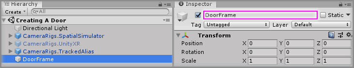
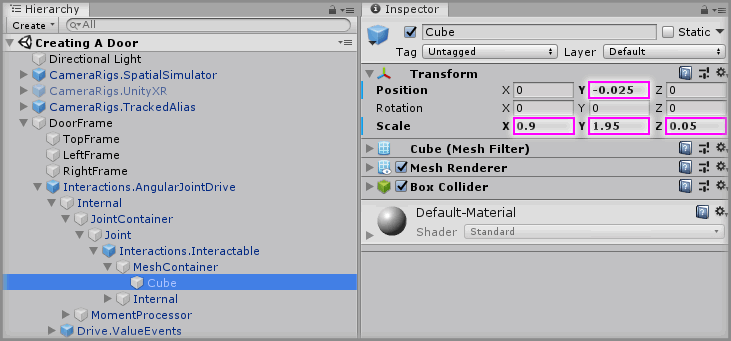
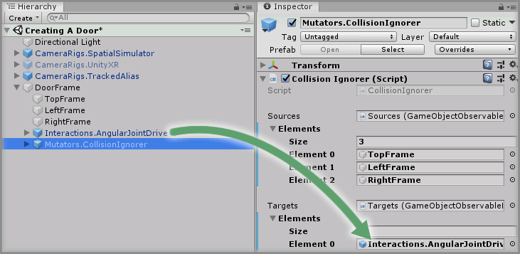

# Creating A Door

> * Level: Beginner
>
> * Reading Time: 10 minutes
>
> * Checked with: Unity 2018.3.14f1

## Introduction

A door is a simple control that allows an interactable to rotate around a given hinge point to simulate a door that can be opened and closed. We're going to use a Angular Drive to create this door control.

## Prerequisites

* [Add the Tilia.Interactions.Interactor.Unity] prefab to the scene Hierarchy.
* [Install the Tilia.Mutators.CollisionIgnorer.Unity] package dependency in to your [Unity] project.
* [Install the Tilia.Interactions.Controllables.Unity] package dependency in to your Unity project.

## Let's Start

### Step 1

Create a new `Empty` GameObject by selecting `Main Menu -> GameObject -> Create Empty` and change the Transform properties to:

* Position: `X = 0, Y = 0, Z = 0`
* Scale: `X = 1, Y = 1, Z = 1`

Rename the new empty `GameObject` to `DoorFrame`.

### Step 2

Right click on the `DoorFrame` GameObject, select `3D Object -> Cube` and change the Transform properties to:

* Position: `X = 0, Y = 1, Z = 0`
* Scale: `X = 1.1, Y = 0.1, Z = 0.1`

Rename the new empty `Cube` to `TopFrame`.

> It may be easier to apply a different material to the `DoorFrame` to make it easier to see.

### Step 3

Create the remaining components of the `DoorFrame` by duplicating the `TopFrame` GameObject 2 times and for each duplicated GameObject change the Transform properties to:

#### TopFrame (1)

* Position: `X = -0.5, Y = 0, Z = 0`
* Scale: X = `0.1, Y = 2, Z = 0.1`

Rename the duplicated `TopFrame (1)` to `LeftFrame`.

#### TopFrame (2)

* Position: `X = 0.5, Y = 0, Z = 0`
* Scale: `X = 0.1, Y = 2, Z = 0.1`

Rename the duplicated `TopFrame (2)` to `RightFrame`.

### Step 4

Expand the `Tilia Interactions Controllables Unity` Package directory in the Unity Project window and select the `Packages -> Tilia Interactions Controllables Unity -> Runtime -> Prefabs -> PhysicsJoint` directory then drag and drop the `Interactions.AngularJointDrive` prefab into the Unity hierarchy window so it becomes a child of the `DoorFrame` GameObject.

> The `Interactions.AngularJointDrive` prefab uses Unity joints and therefore works within the Unity physics system, however the `Interactions.AngularTransformDrive` is an angular drive that does not utilize joints or physics and can easily be swapped in place at this step if required.

### Step 5

Select the `DoorFrame -> Interactions.AngularJointDrive -> Internal -> JointContainer -> Joint -> Interactions.Interactable -> MeshContainer -> Cube` GameObject from the Unity Hierarchy and change the Transform properties to:

* Position: `X = 0, Y = -0.025, Z = 0`
* Scale: `X = 0.9, Y = 1.95, Z = 0.05`

### Step 6

Select the `DoorFrame -> Interactions.AngularJointDrive` GameObject from the Unity Hierarchy and on the `Angular Drive Facade` component set the following properties to:

* Drive Axis: `Y Axis`
* Drive Limit: `Min: -120, Max: 120`
* Hinge Location: `X = -0.45`

### Step 7

We're now going to have an issue with the door control set up in the door frame because both the door and door frame have colliders. This means the door will collide with the door frame and start having adverse effects. We could be really particular with our door and door frame design so the colliders do not intersect or we could cheat a little bit and just get the door frame and door to ignore collisions between each other.

We can do this using the `Mutators.CollisionIgnorer` prefab which will tell all of the colliders in the door frame to ignore all of the colliders in the door.

Expand the `Tilia Mutators CollisionIgnorer Unity` Package directory in the Unity Project window and select the `Packages -> Tilia Mutators CollisionIgnorer Unity -> Runtime -> Prefabs -> PhysicsJoint` directory then drag and drop the `Mutators.CollisionIgnorer` prefab into the Unity hierarchy window so it becomes a child of the `DoorFrame` GameObject.

### Step 8

Select the `DoorFrame -> Mutators.CollisionIgnorer` GameObject from the Unity Hierarchy then increase the `Sources -> Elements -> Size` property value by `3` on the `Collision Ignorer` component.

> The size property will be `0` by default, so change it to `3`.

Drag and drop the `DoorFrame -> TopFrame` GameObject into the newly created `Element 0` property value within `Sources` property on the `Collision Ignorer` component.

> Make sure to do the same for the `LeftFrame` and `RightFrame` GameObjects.

### Step 9

Select the `DoorFrame -> Mutators.CollisionIgnorer` GameObject from the Unity Hierarchy then increase the `Targets -> Elements -> Size` property value by `1` on the `Collision Ignorer` component.

> The size property will be `0` by default, so change it to `1`.

Drag and drop the `DoorFrame -> Interactions.AngularJointDrive` GameObject into the newly created `Element 0` property value within `Targets` property on the `Collision Ignorer` component.

### Done

Play the Unity scene, you will see that pulling the door opens it but it wont pull past its maximum rotation value and that pushing the door also opens it but it will not go past its minimum rotation value.

[Add the Tilia.Interactions.Interactor.Unity]: https://github.com/ExtendRealityLtd/Tilia.Interactions.Interactables.Unity/tree/master/Documentation/HowToGuides/AddingAnInteractor
[Install the Tilia.Mutators.CollisionIgnorer.Unity]: https://github.com/ExtendRealityLtd/Tilia.Mutators.CollisionIgnorer.Unity/tree/master/Documentation/HowToGuides/Installation
[Install the Tilia.Interactions.Controllables.Unity]: https://github.com/ExtendRealityLtd/Tilia.Interactions.Controllables.Unity/tree/master/Documentation/HowToGuides/Installation
[Unity]: https://unity3d.com/