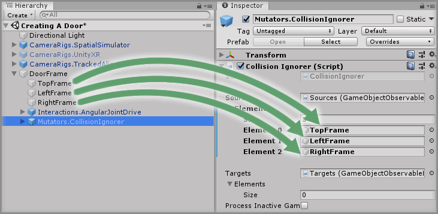

# Creating A Door

> * Level: Beginner
>
> * Reading Time: 10 minutes
>
> * Checked with: Unity 2018.3.14f1

## Introduction

A door is a simple control that allows an Interactable to rotate around a given hinge point to simulate a door that can be opened and closed. We're going to use a Angular Drive to create this door control.

## Prerequisites

* [Add the Tilia.Interactions.Interactor.Unity -> Interactions.Interactor] prefab to the scene hierarchy.
* [Install the Tilia.Mutators.CollisionIgnorer.Unity] package dependency in to your [Unity] project.
* [Install the Tilia.Interactions.Controllables.Unity] package dependency in to your Unity project.

## Let's Start

### Step 1

Create a new `Empty` GameObject by selecting `Main Menu -> GameObject -> Create Empty` and rename it to `DoorFrame`.

### Step 2

Create a new `Cube` Unity 3D Object by selecting `Main Menu -> GameObject -> 3D Object -> Cube` and make it a child of the `DoorFrame` GameObject then change the Transform properties to:

* Position: `X = 0, Y = 1, Z = 0`
* Scale: `X = 1.1, Y = 0.1, Z = 0.1`

Rename the new empty `Cube` to `TopFrame`.

> It may be easier to apply a different material to the `TopFrame` GameObject to make it easier to distinguish.

### Step 3

Create the remaining components of the `DoorFrame` by duplicating the `TopFrame` GameObject two times by right clicking on the `TopFrame` GameObject and selecting `Duplicate` from the context menu.

For each duplicated GameObject change the Transform properties to:

#### TopFrame (1)

* Position: `X = -0.5, Y = 0, Z = 0`
* Scale: X = `0.1, Y = 2, Z = 0.1`

Rename the duplicated `TopFrame (1)` to `LeftFrame`.

#### TopFrame (2)

* Position: `X = 0.5, Y = 0, Z = 0`
* Scale: `X = 0.1, Y = 2, Z = 0.1`

Rename the duplicated `TopFrame (2)` to `RightFrame`.

### Step 4

Add a `Interactions.AngularJointDrive` prefab to the Unity project hierarchy by selecting `GameObject -> Tilia -> Prefabs -> Interactions -> Controllables -> PhysicsJoint -> Interactions.AngularJointDrive` from the Unity main top menu and drag it into being a child of the `DoorFrame` GameObject.

> The `Interactions.AngularJointDrive` prefab uses Unity joints and therefore works within the Unity physics system, however the `Interactions.AngularTransformDrive` is an angular drive that does not utilize joints or physics and can easily be swapped in place at this step if required.

### Step 5

Select the `DoorFrame -> Interactions.AngularJointDrive -> Internal -> JointContainer -> Joint -> Interactions.Interactable -> MeshContainer -> Cube` GameObject from the Unity Hierarchy window and change the Transform properties to:

* Position: `X = 0, Y = -0.025, Z = 0`
* Scale: `X = 0.9, Y = 1.95, Z = 0.05`

### Step 6

Select the `DoorFrame -> Interactions.AngularJointDrive` GameObject from the Unity Hierarchy window and on the `Angular Drive Facade` component set the following properties to:

* Drive Axis: `Y Axis`
* Drive Limit: `Min: -120` / `Max: 120`
* Hinge Location: `X = -0.45, Y = 0, Z = 0`

### Step 7

We're going to have an issue with the door control being in the door frame because both the door and door frame have colliders. This means the door will collide with the door frame and start having adverse effects.

We could be really particular with our door and door frame design so the colliders do not intersect or we could cheat a little bit and just get the door frame and door to ignore collisions between each other.

We can do this using the `Mutators.CollisionIgnorer` prefab which will tell all of the colliders in the door frame to ignore all of the colliders in the door.

Add a `Mutators.CollisionIgnorer` prefab to the Unity project hierarchy by selecting `GameObject -> Tilia -> Prefabs -> Mutators -> Mutators.CollisionIgnorer` from the Unity main top menu and drag it into being a child of the `DoorFrame` GameObject.

### Step 8

Select the `DoorFrame -> Mutators.CollisionIgnorer` GameObject from the Unity Hierarchy window then increase the `Sources -> Elements -> Size` property value by `3` on the `Collision Ignorer` component.

> The size property will be `0` by default, so change it to `3`.

Drag and drop the `DoorFrame -> TopFrame` GameObject into the newly created `Element 0` property value within `Sources` property on the `Collision Ignorer` component.

Then drag the `LeftFrame` GameObject into `Element 1` and the `RightFrame` GameObject into `Element 2` property value within the `Sources` property on the `Collision Ignorer` component.

### Step 9

Select the `DoorFrame -> Mutators.CollisionIgnorer` GameObject from the Unity Hierarchy window then increase the `Targets -> Elements -> Size` property value by `1` on the `Collision Ignorer` component.

> The size property will be `0` by default, so change it to `1`.

Drag and drop the `DoorFrame -> Interactions.AngularJointDrive` GameObject into the newly created `Element 0` property value within `Targets` property on the `Collision Ignorer` component.

### Done

Play the Unity scene, you will see that pulling the door opens it but it wont pull past its maximum rotation value and that pushing the door also opens it but it will not go past its minimum rotation value.

[Add the Tilia.Interactions.Interactor.Unity -> Interactions.Interactor]: https://github.com/ExtendRealityLtd/Tilia.Interactions.Interactables.Unity/tree/master/Documentation/HowToGuides/AddingAnInteractor/README.md
[Install the Tilia.Mutators.CollisionIgnorer.Unity]: https://github.com/ExtendRealityLtd/Tilia.Mutators.CollisionIgnorer.Unity/tree/master/Documentation/HowToGuides/Installation/README.md
[Install the Tilia.Interactions.Controllables.Unity]: ../Installation/README.md 
[Unity]: https://unity3d.com/