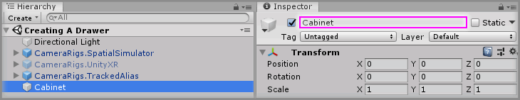
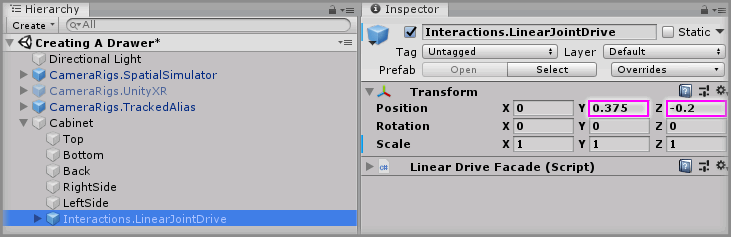
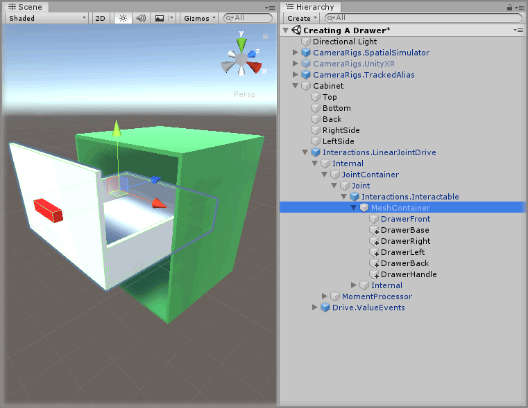
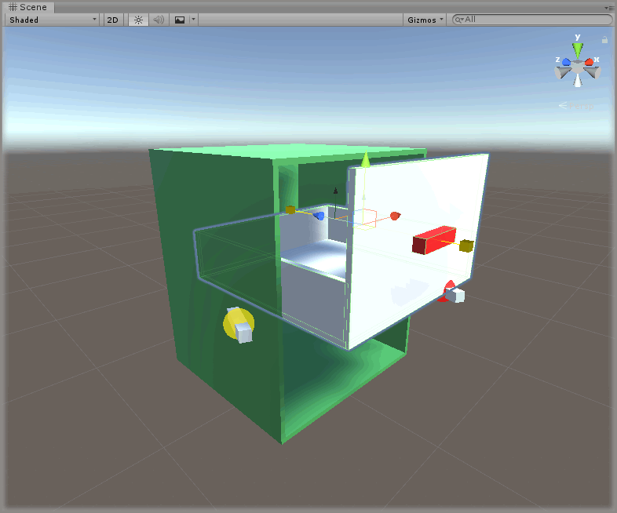

# Creating A Drawer

* Level: Beginner

* Reading Time: 10 minutes

* Checked with: Unity 2018.3.14f1

## Introduction

A drawer is a simple example of how to use a Linear Drive to create a sliding object that is limited along an axis.

## Prerequisites

* [Add the Tilia.Interactions.Interactor.Unity -> Interactions.Interactor] prefab to the scene hierarchy.
* [Install the Tilia.Interactions.Controllables.Unity] package dependency in to your [Unity] project.

## Let's Start

### Step 1

Create a new `Empty` GameObject by selecting `Main Menu -> GameObject -> Create Empty` and rename it to `Cabinet`.

### Step 2

Create a new `Cube` Unity 3D Object by selecting `Main Menu -> GameObject -> 3D Object -> Cube` and make it a child of the `Cabinet` GameObject then change the Transform properties to:

* Position: `X = 0, Y = 0.5, Z = 0`
* Scale: `X = 0.43, Y = 0.01, Z = 0.4`

Rename the new `Cube` to `Top`.

> It may be easier to apply a different material to the `Top` GameObject to make it easier to distinguish.

### Step 3

Create the remaining components of the `Cabinet` by duplicating the `Top` GameObject four times by right clicking on the `Top` GameObject and selecting `Duplicate` from the context menu.

For each duplicated GameObject change the Transform properties to:

#### Top (1)

* Position: `X = 0, Y = 0, Z = 0`
* Scale: X = `0.43, Y = 0.01, Z = 0.4`

Rename the duplicated `Top (1)` to `Bottom`.

#### Top (2)

* Position: `X = 0, Y = 0.25, Z = 0.195`
* Scale: `X = 0.43, Y = 0.5, Z = 0.01`

Rename the duplicated `Top (2)` to `Back`.

#### Top (3)

* Position: `X = 0.21, Y = 0.25, Z = 0`
* Scale: `X = 0.01, Y = 0.5, Z = 0.4`

Rename the duplicated `Top (3)` to `RightSide`.

#### Top (4)

* Position: `X = -0.21, Y = 0.25, Z = 0`
* Scale: `X = 0.01, Y = 0.5, Z = 0.4`

Rename the duplicated `Top (4)` to `LeftSide`.

### Step 4

Add a `Interactions.LinearJointDrive` prefab to the Unity project hierarchy by selecting `GameObject -> Tilia -> Prefabs -> Interactions -> Controllables -> PhysicsJoint -> Interactions.LinearJointDrive` from the Unity main top menu and drag it into being a child of the `Cabinet` GameObject.

> The `Interactions.LinearJointDrive` prefab uses Unity joints and therefore works within the Unity physics system, however the `Interactions.LinearTransformDrive` is a linear drive that does not utilize joints or physics and can easily be swapped in place at this step if required.

### Step 5

Select the `Interactions.LinearJointDrive` GameObject and change the Transform properties to:

* Position: `X = 0, Y = 0.375, Z = -0.2`

### Step 6

Select the `Cabinet -> Interactions.LinearJointDrive -> Internal -> JointContainer -> Joint -> Interactions.Interactable -> MeshContainer -> Cube` GameObject from the Unity Hierarchy window and change the Transform properties to:

* Position: `X = 0, Y = 0, Z = -0.2`
* Scale: `X = 0.4, Y = 0.25, Z = 0.01`

Rename the `Cube` to `DrawerFront`.

### Step 7

Create the remaining components of the `Drawer` by duplicating the `DrawerFront` GameObject five times by right clicking on the `DrawerFront` GameObject and selecting `Duplicate` from the context menu.

For each duplicated GameObject change the Transform properties to:

#### DrawerFront (1)

* Position: `X = 0, Y = -0.12, Z = 0`
* Scale: `X = 0.4, Y = 0.01, Z = 0.4`

Rename the duplicated `DrawerFront (1)` to `DrawerBase`.

#### DrawerFront (2)

* Position: `X = 0.195, Y = -0.075, Z = 0`
* Scale: `X = 0.01, Y = 0.1, Z = 0.4`

Rename the duplicated `DrawerFront (2)` to `DrawerRight`.

#### DrawerFront (3)

* Position: `X = -0.195, Y = -0.075, Z = 0`
* Scale: `X = 0.01, Y = 0.1, Z = 0.4`

Rename the duplicated `DrawerFront (3)` to `DrawerLeft`.

#### DrawerFront (4)

* Position: `X = 0, Y = -0.075, Z = 0.195`
* Scale: `X = 0.4, Y = 0.1, Z = 0.01`

Rename the duplicated `DrawerFront (4)` to `DrawerBack`.

#### DrawerFront (5)

* Position: `X = 0, Y = 0, Z = -0.215`
* Scale: `X = 0.1, Y = 0.025, Z = 0.025`

Rename the duplicated `DrawerFront (5)` to `DrawerHandle`.

> It may be easier to apply a different material to the `DrawerHandle` GameObject to make it easier to distinguish.

### Step 8

Select the `Cabinet -> Interactions.LinearJointDrive` GameObject from the Unity Hierarchy window and on the `Linear Drive Facade` component set the following properties to:

* Drive Axis: `Z Axis`
* Start At Initial Target Value: `checked`
* Initial Target Value: `1`
* Drive Limit: `0.4`

### Done

Play the Unity scene, you will notice the drawer automatically snaps to its closed position. You will also notice pulling the drawer opens it out to until the drawer reaches the maximum limit.

[Add the Tilia.Interactions.Interactor.Unity -> Interactions.Interactor]: https://github.com/ExtendRealityLtd/Tilia.Interactions.Interactables.Unity/tree/master/Documentation/HowToGuides/AddingAnInteractor/README.md
[Install the Tilia.Interactions.Controllables.Unity]: ../Installation/README.md
[Unity]: https://unity3d.com/