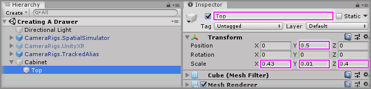
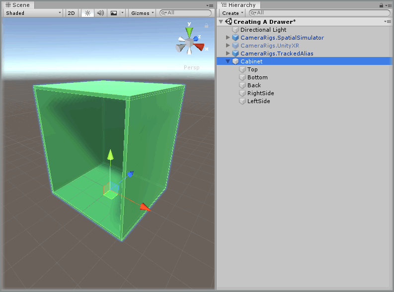
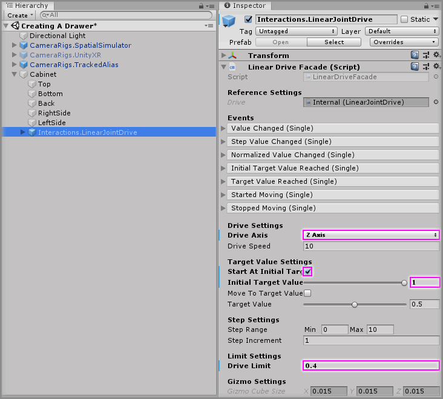

# Creating A Drawer

> * Level: Beginner
>
> * Reading Time: 10 minutes
>
> * Checked with: Unity 2018.3.14f1

## Introduction

A drawer is a simple example of how to use a Linear Drive to create a sliding object that is limited along an axis.

## Prerequisites

* [Add the Tilia.Interactions.Interactor.Unity] prefab to the scene Hierarchy.
* [Install the Tilia.Interactions.Controllables.Unity] package dependency in to your [Unity] project.

## Let's Start

### Step 1

Create a new `Empty` GameObject by selecting `Main Menu -> GameObject -> Create Empty` and change the Transform properties to:

* Position: `X = 0, Y = 0, Z = 0`
* Scale: `X = 1, Y = 1, Z = 1`

Rename the new empty `GameObject` to `Cabinet`.

### Step 2

Right click on the `Cabinet` GameObjet, select `3D Object -> Cube` and change the Transform properties to:

* Position: `X = 0, Y = 0.5, Z = 0`
* Scale: `X = 0.43, Y = 0.01, Z = 0.4`

Rename the new empty `Cube` to `Top`.

> It may be easier to apply a different material to the cabinet to make it easier to see.

### Step 3

Create the remaining components of the `Cabinet` by duplicating the `Top` GameObject 4 times and for each duplicated GameObject change the Transform properties to:

#### Top (1)

* Position: `X = 0, Y = 0, Z = 0`
* Scale: X = `0.43, Y = 0.01, Z = 0.4`

Rename the duplicated `Top (1)` to `Bottom`.

#### Top (2)

* Position: `X = 0, Y = 0.25, Z = 0.195`
* Scale: `X = 0.43, Y = 0.5, Z = 0.01`

Rename the duplicated `Top (2)` to `Back`.

#### Top (3)

* Position: `X = 0.21, Y = 0.25, Z = 0`
* Scale: `X = 0.01, Y = 0.5, Z = 0.4`

Rename the duplicated `Top (3)` to `RightSide`.

#### Top (4)

* Position: `X = -0.21, Y = 0.25, Z = 0`
* Scale: `X = 0.01, Y = 0.5, Z = 0.4`

Rename the duplicated `Top (4)` to `LeftSide`.

### Step 4

Expand the `Tilia Interactions Controllables Unity` Package directory in the Unity Project window and select the `Packages -> Tilia Interactions Controllables Unity -> Runtime -> Prefabs -> PhysicsJoint` directory then drag and drop the `Interactions.LinearJointDrive` prefab into the Unity hierarchy window so it becomes a child of the `Cabinet` GameObject.

> The `Interactions.LinearJointDrive` prefab uses Unity joints and therefore works within the Unity physics system, however the `Interactions.LinearTransformDrive` is a linear drive that does not utilize joints or physics and can easily be swapped in place at this step if required.

Select the `Interactions.LinearJointDrive` GameObject and change the Transform properties to:

* Position: `X = 0, Y = 0.375, Z = -0.2`

### Step 5

Select the `Cabinet -> Interactions.LinearJointDrive -> Internal -> JointContainer -> Joint -> Interactions.Interactable -> MeshContainer -> Cube` GameObject from the Unity Hierarchy and change the Transform properties to:

* Position: `X = 0, Y = 0, Z = -0.2`
* Scale: `X = 0.4, Y = 0.25, Z = 0.01`

### Step 6

Create the remaining components of the `Drawer` by duplicating the `Cube` GameObject 5 times and for each duplicated GameObject change the Transform properties to:

#### Cube (1)

* Position: `X = 0, Y = -0.12, Z = 0`
* Scale: `X = 0.4, Y = 0.01, Z = 0.4`

#### Cube (2)

* Position: `X = 0.195, Y = -0.075, Z = 0`
* Scale: `X = 0.01, Y = 0.1, Z = 0.4`

#### Cube (3)

* Position: `X = -0.195, Y = -0.075, Z = 0`
* Scale: `X = 0.01, Y = 0.1, Z = 0.4`

#### Cube (4)

* Position: `X = 0, Y = -0.075, Z = 0.195`
* Scale: `X = 0.4, Y = 0.1, Z = 0.01`

#### Cube (5)

* Position: `X = 0, Y = 0, Z = -0.215`
* Scale: `X = 0.1, Y = 0.025, Z = 0.025`

### Step 7

Select the `Cabinet -> Interactions.LinearJointDrive` GameObject from the Unity Hierarchy and on the `Linear Drive Facade` component set the following properties to:

* Drive Axis: `Z Axis`
* Start At Initial Target Value: `checked`
* Initial Target Value: `1`
* Drive Limit: `0.04`

### Done

Play the Unity Scene, you will notice the drawer automatically snaps to its closed position. You will also notice pulling the drawer opens it out to its limit.

[Add the Tilia.Interactions.Interactor.Unity]: https://github.com/ExtendRealityLtd/Tilia.Interactions.Interactables.Unity/tree/master/Documentation/HowToGuides/AddingAnInteractor
[Install the Tilia.Interactions.Controllables.Unity]: https://github.com/ExtendRealityLtd/Tilia.Interactions.Controllables.Unity/tree/master/Documentation/HowToGuides/Installation
[Unity]: https://unity3d.com/