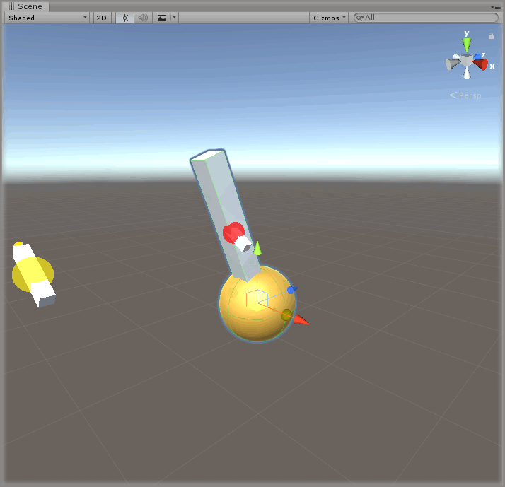

# Creating A Lever

> * Level: Beginner
> 
> * Reading Time: 5 minutes
> 
> * Checked with: Unity 2018.3.14f1

## Introduction

A lever control can be created by using a Angular Drive and rotating it around an offset hinge point. The lever value changes could be used to denote when something is in an on/off position or could be used as an analog value control.

## Prerequisites

* [Add the Tilia.Interactions.Interactor.Unity -> Interactions.Interactor] prefab to the scene hierarchy.
* [Install the Tilia.Interactions.Controllables.Unity] package dependency in to your [Unity] project.

## Let's Start

### Step 1

Create a new `Empty` GameObject by selecting `Main Menu -> GameObject -> Create Empty` and rename it to `Lever`.

### Step 2

Create a new `Sphere` Unity 3D Object by selecting `Main Menu -> GameObject -> 3D Object -> Sphere` and make it a child of the `Lever` GameObject then change the Transform properties to:

* Scale: `X = 0.2, Y = 0.2, Z = 0.2`

Rename the new `Sphere` to `Base` and disable the `Sphere Collider` component.

### Step 3

Add a `Interactions.AngularJointDrive` prefab to the Unity project hierarchy by selecting `GameObject -> Tilia -> Prefabs -> Interactions -> Controllables -> PhysicsJoint -> Interactions.AngularJointDrive` from the Unity main top menu and drag it into being a child of the `Lever` GameObject.

> The `Interactions.AngularJointDrive` prefab uses Unity joints and therefore works within the Unity physics system, however the `Interactions.AngularTransformDrive` is an angular drive that does not utilize joints or physics and can easily be swapped in place at this step if required.

### Step 4

Change the Transform properties of the `Lever -> Interactions.AngularJointDrive` GameObject to:

* Position: `X = 0, Y = 0.2, Z = 0`

### Step 5

Select the `Interactions.AngularJointDrive` GameObject from the Unity Hierarchy window and on the `Angular Drive Facade` component set the following properties to:

* Start At Initial Target Value: `checked`
* Initial Target Value: `1`
* Drive Limit: `Min = -45` / `Max = 45`
* Hinge Location: `X = 0, Y = -0.2, Z = 0`

### Step 6

Select the `Lever -> Interactions.AngularJointDrive -> Internal -> JointContainer -> Joint -> Interactions.Interactable -> MeshContainer -> Cube` GameObject and change the Transform properties to:

* Scale `X = 0.05, Y = 0.4, Z = 0.05`

### Done

Play the Unity scene you should notice the Lever go into its start position using the controller you will be able to move it between its on and off positions.

[Add the Tilia.Interactions.Interactor.Unity -> Interactions.Interactor]: https://github.com/ExtendRealityLtd/Tilia.Interactions.Interactables.Unity/tree/master/Documentation/HowToGuides/AddingAnInteractor/README.md
[Install the Tilia.Interactions.Controllables.Unity]: ../Installation/README.md 
[Unity]: https://unity3d.com