#  Creating A Physics Button

> * Level: Intermediate
>
> * Reading Time: 10 minutes
>
> * Checked with: Unity 2018.3.14f1

## Introduction

A physics based button can easily be created using a Linear Joint Drive and a Collider Follower to have the Interactors physically be able to push down on the button control and then hook into the drive events to know when the button has been pressed or released.

## Prerequisites

* [Add the Tilia.Interactions.Interactor.Unity] prefab to the scene Hierarchy.
* [Add the Tilia.Trackers.ColliderFollower.Unity] prefab to the scene Hierarchy.
* [Install the Tilia.Interactions.Controllables.Unity] package dependency in to your [Unity] project.

## Let's Start

### Step 1

Create a new `Empty` GameObject by selecting `Main Menu -> GameObject -> Create Empty` and rename it to `ButtonContainer`.

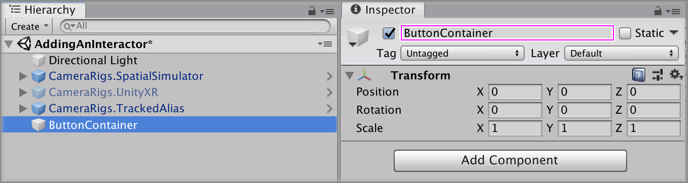

Expand the `Tilia Interactions Controllables Unity` Package directory in the Unity Project window and select the `Packages -> Tilia Interactions Controllables Unity -> Runtime -> Prefabs -> Physics Joint` directory then drag and drop the `LinearJointDrive` prefab into the Unity hierarchy window so it is a child of the `ButtonContainer` Empty GameObject.

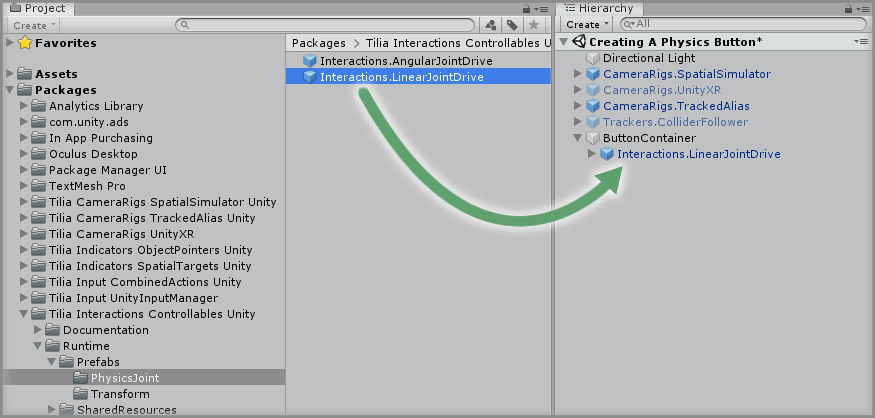

### Step 2

Select the `ButtonContainer -> Interactions.LinearJointDrive -> Internal -> JointContainer -> Joint -> Interactions.Interactable -> MeshContainer -> Cube` GameObject and change the transform properties to:

*  Scale: ` X = 0.2, Y = 0.02, Z = 0.15`

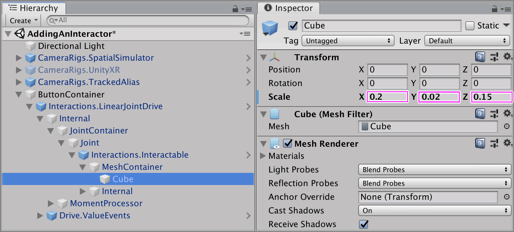

### Step 3

Select the `Interactions.LinearJointDrive` GameObject from the Unity Hierarchy and on the `Linear Drive Facade` component set the following properties to:

* Drive Axis: `Y Axis`
* Start At Initial Target Value: `checked`
* Initial Target Value: `1`
* Move To Target Value: `checked`
* Moved Target Value: `1`
* Drive Limit: `0.05`

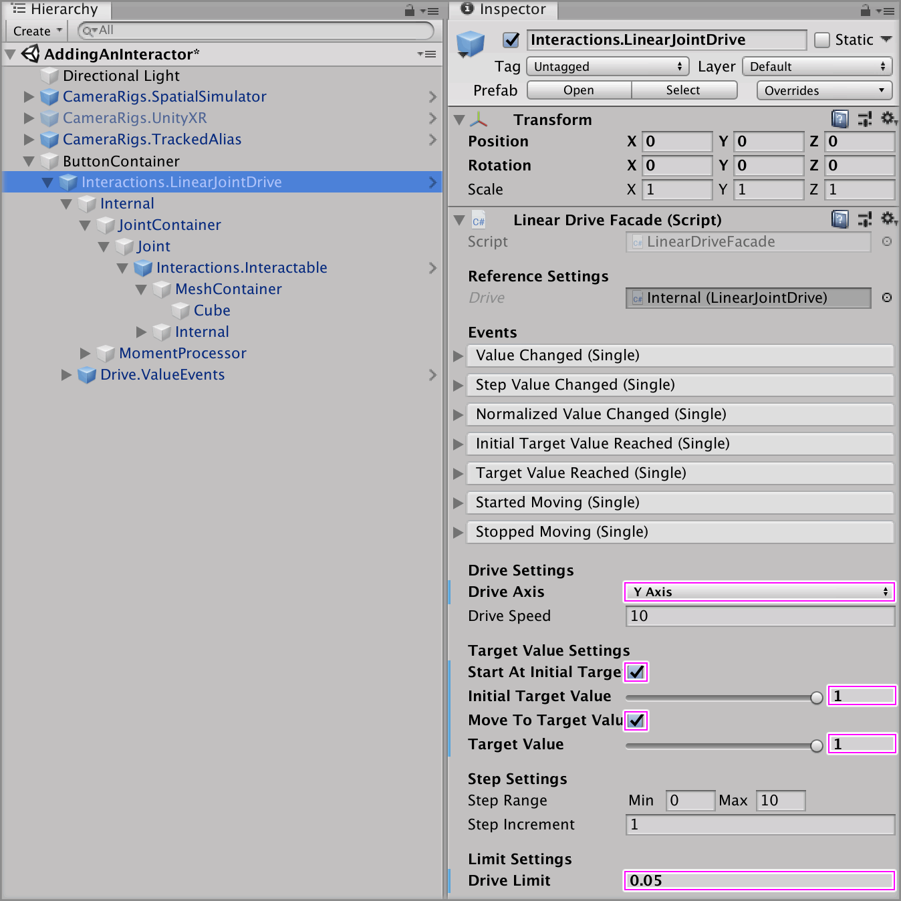

### Step 4

Create a new `Empty` GameObject and make it a child of the `ButtonContainer` GameObject, rename it to `ActivationArea`.

Add a `Box Collider` that is going to be the trigger and set the `Box Collider` component properties to:

* Is Trigger: `checked`
* Size: ` X = 0.25, Y = 0.15, Z = 0.2`

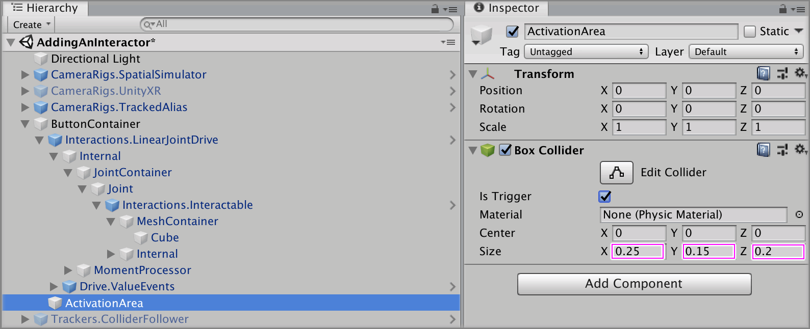

Add a `Collision Tracker` component then we will want to add two events that will turn on our `Collider Follower` GameObject.

Select the `Activation Area` GameObject from the Unity Hierarchy and click the `+` symbol in the bottom right corner of the `Collision Started` event parameter on the `Collision Tracker` component.

Drag and drop the `Collision Follower` GameObject into the event listener box that appears on the `Collision Started` event parameter on the `Collision Tracker` component that displays `None (Object)`.

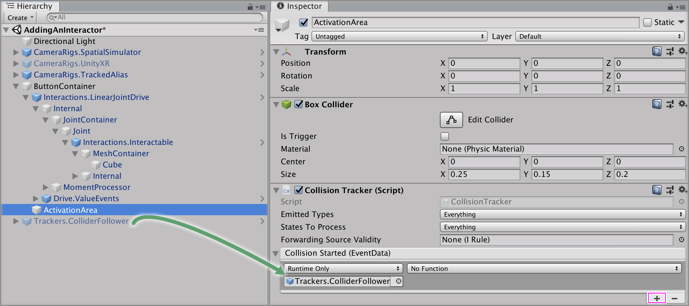

Select a function to perform when the `Collision Started` event is emitted. For this example, select the `GameObject -> Set Active` function. Ensure the `Set Active` checkbox is `checked`.

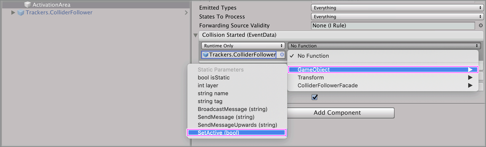

### Step 5

Select the `Activation Area` GameObject from the Unity Hierarchy and click the `+` symbol in the bottom right corner of the `Collision Stopped` event parameter on the `Collision Tracker` component.

Drag and drop the `Collision Follower` GameObject into the event listener box that appears on the `Collision Stopped` event parameter on the `Collision Tracker` component that displays `None (Object)`.

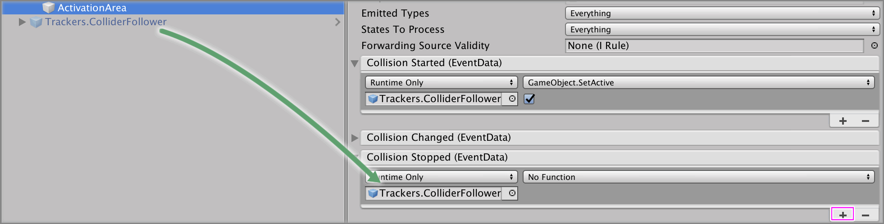

Select a function to perform when the `Collision Stopped` event is emitted. For this example, select the `GameObject -> Set Active` function. Ensure the `Set Active` checkbox is `unchecked`.

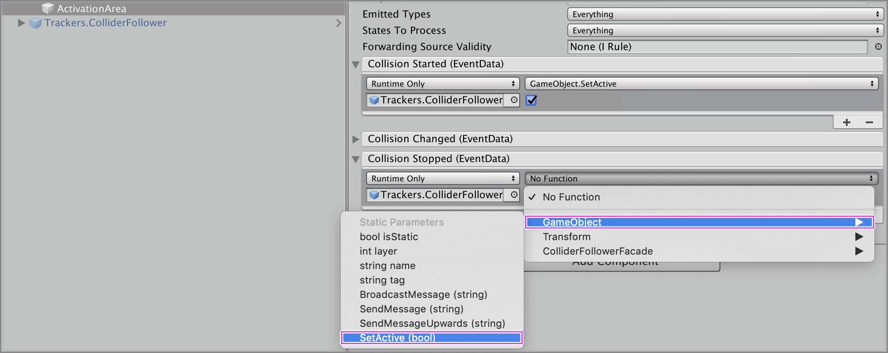

### Step 6

Select the `Activation Area` GameObject from the Unity Hierarchy and click the `+` symbol in the bottom right corner of the `Collision Started` event parameter on the `Collision Tracker` component.

Drag and drop the `Collision Follower` GameObject into the event listener box that appears on the `Collision Started` event parameter on the `Collision Tracker` component that displays `None (Object)`.

Select a function to perform when the `Collision Started` event is emitted. For this example, select the `ColliderFollowerFacade -> SnapToSource()` function.

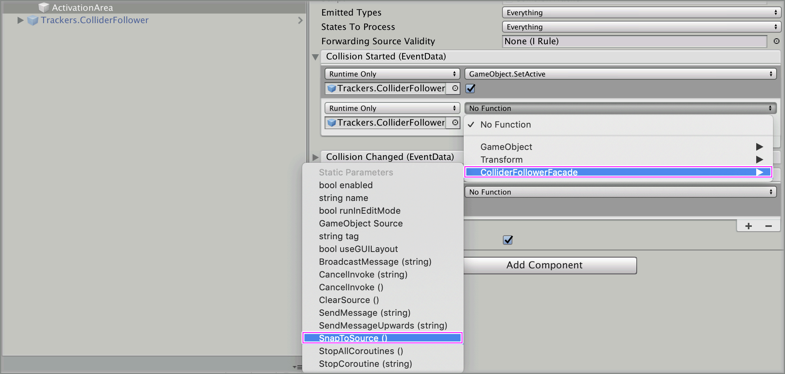

### Step 7

Create a new `Empty` GameObject and make it a child of the `ButtonContainer` GameObject, rename it to `Valid Collisions`, add an `Any Component Type Rule`.

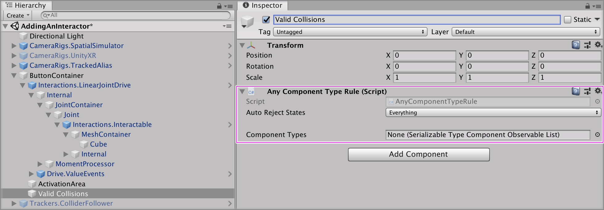

As a child of the `Valid Collisions` GameObject create a new `Empty` GameObject and name it `List`. Add a `Serializable Type Component Observable List` component.

Select the `List` GameObject in the Unity hierachy window then increase the `List Settings -> Elements -> Size` property by `1 `on the `Serializable Type Component Observable List` component.

> The property will be 0 by default so change it to 1

Set `Element 0` property value to `InteractorFacade`.

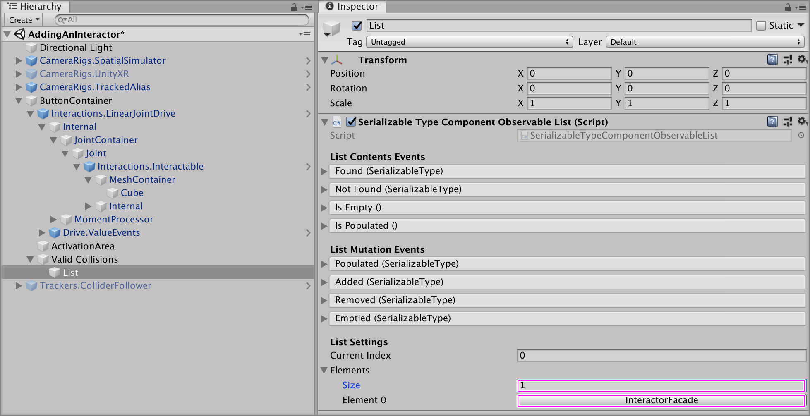

### Step 8

Select the `Valid Collisions` GameObject and drag and drop the `List` GameObject into the `Component Types` property on the `Any Component Type Rule` component.

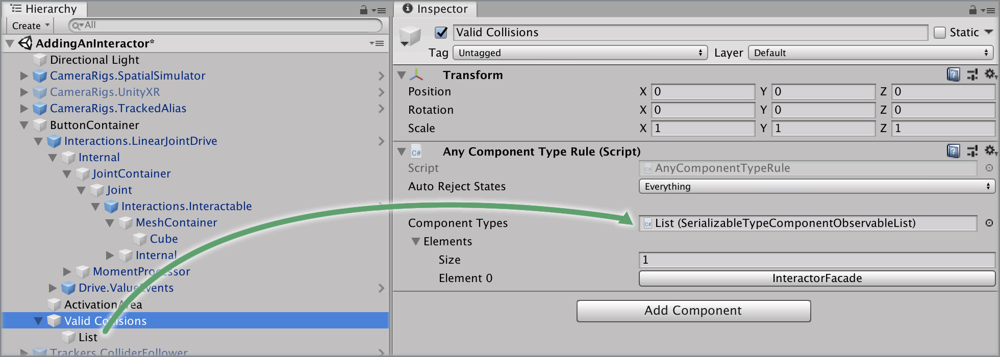

### Step 9

Select the `Activation Area` GameObject and drag and drop the `Valid Collisions` GameObject into the `Forwarding Source Validity` property on the `Collision Tracker` component.

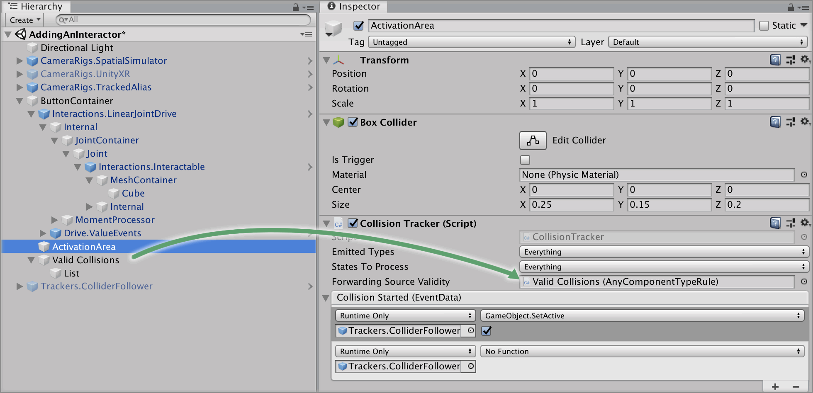

### Done

Play the scene and you will notice as you push down with the Right Controller on the button moves it down to its maximum point and releasing it moves it back to its original position.

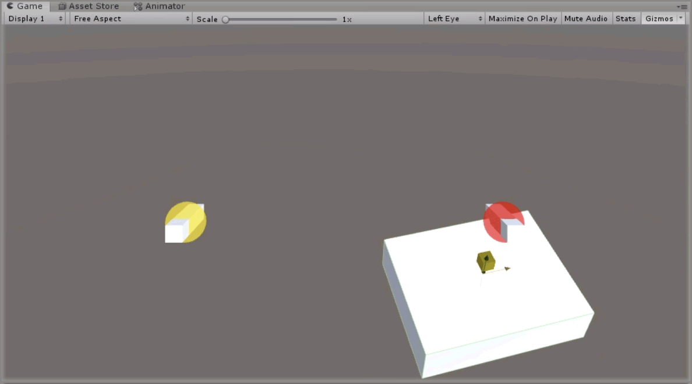

[Unity]: https://unity3d.com/
[Add the Tilia.Interactions.Interactor.Unity]: https://github.com/ExtendRealityLtd/Tilia.Interactions.Interactables.Unity/tree/master/Documentation/HowToGuides/AddingAnInteractor
[Add the Tilia.Trackers.ColliderFollower.Unity]: https://github.com/ExtendRealityLtd/Tilia.Trackers.ColliderFollower.Unity/tree/master/Documentation/HowToGuides/AddingAColliderFollower
[Install the Tilia.Interactions.Controllables.Unity]: ../Installation/README.md
