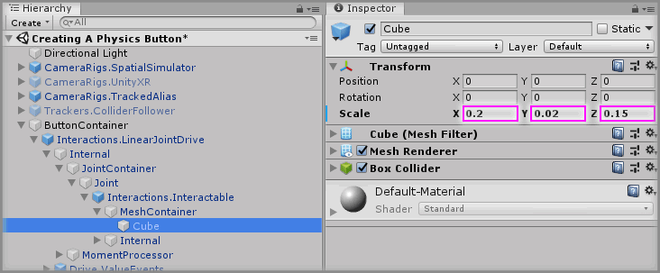
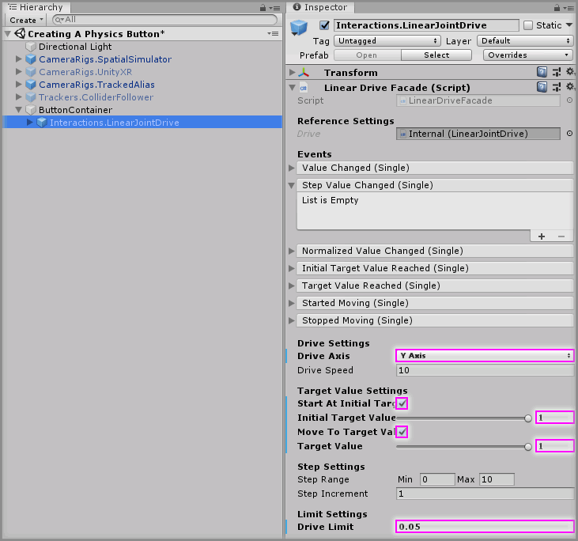
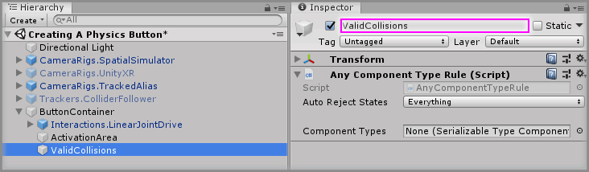
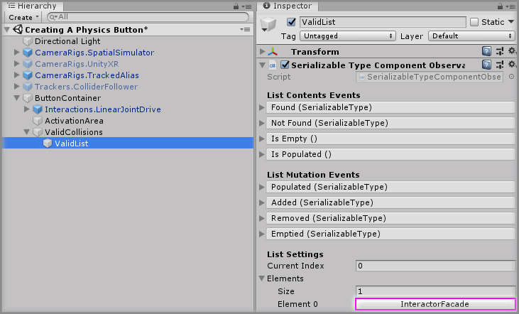

#  Creating A Physics Button

> * Level: Intermediate
>
> * Reading Time: 20 minutes
>
> * Checked with: Unity 2018.3.14f1

## Introduction

A physics based button can easily be created using a Linear Joint Drive and a Collider Follower to have the Interactors physically be able to push down on the button control and then hook into the drive events to know when the button has been pressed or released.

## Prerequisites

* [Add the Tilia.Interactions.Interactor.Unity -> Interactions.Interactor] prefab to the scene hierarchy.
* [Add the Tilia.Trackers.ColliderFollower.Unity -> Trackers.ColliderFollower] prefab to the scene hierarchy.
* [Install the Tilia.Interactions.Controllables.Unity] package dependency in to your [Unity] project.

## Let's Start

### Step 1

We're going to be using the Collider Follower set up in the [Adding A Collider Follower] guide to allow us to press the button with our controller. We need to clean up some elements from the scene that we're not going to need.

Select `Table` GameObject, the `Interactions.Interactable` GameObject and the `Input.UnityInputManager.ButtonAction` GameObject that were created during the [Adding A Collider Follower] guide, then press the Delete key to delete these from our scene.

### Step 2

Create a new `Empty` GameObject by selecting `Main Menu -> GameObject -> Create Empty` and rename it to `ButtonContainer`.

### Step 3

Add a `Interactions.LinearJointDrive` prefab to the Unity project hierarchy by selecting `GameObject -> Tilia -> Prefabs -> Interactions -> Controllables -> PhysicsJoint -> Interactions.LinearJointDrive` from the Unity main top menu and drag it into being a child of the `ButtonContainer` GameObject.

### Step 4

Select the `ButtonContainer -> Interactions.LinearJointDrive -> Internal -> JointContainer -> Joint -> Interactions.Interactable -> MeshContainer -> Cube` GameObject and change the Transform properties to:

* Scale: `X = 0.2, Y = 0.02, Z = 0.15`

### Step 5

Select the `ButtonContainer -> Interactions.LinearJointDrive` GameObject from the Unity Hierarchy window and on the `Linear Drive Facade` component set the following properties to:

* Drive Axis: `Y Axis`
* Start At Initial Target Value: `checked`
* Initial Target Value: `1`
* Move To Target Value: `checked`
* Target Value: `1`
* Drive Limit: `0.05`

### Step 6

Create a new `Empty` GameObject by selecting `Main Menu -> GameObject -> Create Empty`and make it a child of the `ButtonContainer` GameObject then rename it to `ActivationArea`.

Add a `Box Collider` component (this will activate our Collider Follower) and set the `Box Collider` component properties to:

* Is Trigger: `checked`
* Size: ` X = 0.25, Y = 0.15, Z = 0.2`

### Step 7

Add a `Collision Tracker` component to the `ActivationArea` GameObject, which will track collisions against the `Box Collider` component. We will use this collision tracking to turn on and off our `Trackers.ColliderFollower` GameObject.

Select the `ButtonContainer -> ActivationArea` GameObject from the Unity Hierarchy window and click the `+` symbol in the bottom right corner of the `Collision Started` event parameter on the `Collision Tracker` component.

Drag and drop the `Trackers.ColliderFollower` GameObject into the event listener box that appears on the `Collision Started` event parameter on the `Collision Tracker` component that displays `None (Object)`.

Select a function to perform when the `Collision Started` event is emitted. For this example, select the `GameObject -> SetActive` function.

Ensure the `GameObject.SetActive` checkbox is `checked`.

### Step 8

Select the `ButtonContainer -> ActivationArea` GameObject from the Unity Hierarchy window and click the `+` symbol in the bottom right corner of the `Collision Stopped` event parameter on the `Collision Tracker` component.

Drag and drop the `Trackers.ColliderFollower` GameObject into the event listener box that appears on the `Collision Stopped` event parameter on the `Collision Tracker` component that displays `None (Object)`.

Select a function to perform when the `Collision Stopped` event is emitted. For this example, select the `GameObject -> SetActive` function.

Ensure the `GameObject.SetActive` checkbox is `unchecked`.

### Step 9

Select the `ButtonContainer -> ActivationArea` GameObject from the Unity Hierarchy window and click the `+` symbol in the bottom right corner of the `Collision Started` event parameter on the `Collision Tracker` component.

Drag and drop the `Trackers.ColliderFollower` GameObject into the event listener box that appears on the `Collision Started` event parameter on the `Collision Tracker` component that displays `None (Object)`.

Select a function to perform when the `Collision Started` event is emitted. For this example, select the `ColliderFollowerFacade -> SnapToSource()` function.

### Step 10

Create a new `Empty` GameObject by selecting `Main Menu -> GameObject -> Create Empty` and make it a child of the `ButtonContainer` GameObject, rename it to `ValidCollisions` and add an `Any Component Type Rule` component.

### Step 11

Create a new `Empty` GameObject by selecting `Main Menu -> GameObject -> Create Empty` and make it a child of the `ButtonContainer -> ValidCollisions` GameObject, rename it to `CollisionList` and add a `Serializable Type Component Observable List` component.

### Step 12

Select the `ButtonContainer -> ValidCollisions -> CollisionList` GameObject in the Unity Hierachy window then increase the `List Settings -> Elements -> Size` property by `1 `on the `Serializable Type Component Observable List` component.

> The property will be 0 by default so change it to 1

Set `Element 0` property value to `InteractorFacade`.

### Step 13

Select the `ButtonContainer -> ValidCollisions` GameObject and drag and drop the `ButtonContainer -> ValidCollisions -> CollisionList` GameObject into the `Component Types` property on the `Any Component Type Rule` component.

> The `Serializable Type Component Observable List` component will now become available to edit on the `Any Component Type Rule` component.

### Step 14

Select the `ButtonContainer -> ActivationArea` GameObject and drag and drop the `ButtonContainer -> ValidCollisions` GameObject into the `Forwarding Source Validity` property on the `Collision Tracker` component.

> We've now set it up so the `ActivationArea` will enable the `Trackers.ColliderFollower` GameObject whenever an `InteractorFacade` GameObject collides with the `ActivationArea` collider component.

Play the scene and you will notice as you push down with the Right Controller on the button moves it down to its maximum point and releasing it moves it back to its original position.

However, our Left Controller does not seem to interact with the button at all. This is because the [Adding A Collider Follower] guide only sets up a `Trackers.ColliderFollower` for the Right Controller. 
We will need to set up one for the Left Controller and add some extra logic to know when to activate the correct one.

### Step 15

Let's start by renaming the existing `Trackers.ColliderFollower` GameObject to `Right.ColliderFollower` and then duplicate the `Right.ColliderFollower` GameObject by right clicking on the `Right.ColliderFollower` GameObject and selecting `Duplicate` from the context menu.

Rename this duplicated `Right.ColliderFollower (1)` GameObject to `Left.ColliderFollower`.

### Step 16

We need to make our new `Left.ColliderFollower` follow the Left Controller instead of the Right Controller, so select the `Left.ColliderFollower` GameObject and then drag and drop the `TrackedAlias -> Aliases -> LeftControllerAlias` GameObject onto the `Source` property of the `Collider Follower Facade` component.

### Step 17

Let's now make the correct Collider Follower enable and disable correctly depending on the Controller Alias that is actually touching the Activation Area. To do this we'll use some rules that allow us to know which Controller Alias is touching the Activation Area and be able to trigger some specific logic for each controller.

Create a new `Empty` GameObject by selecting `Main Menu -> GameObject -> Create Empty` and make it a child of the `ButtonContainer` GameObject and rename it to `InteractorRules`.

Then create a new `Empty` GameObject by selecting `Main Menu -> GameObject -> Create Empty` and make it a child of the `ButtonContainer -> InteractorRules` GameObject, rename it to `IsLeftInteractor` and add a `List Contains Rule` component.

### Step 18

Create a new `Empty` GameObject by selecting `Main Menu -> GameObject -> Create Empty` and make it a child of the `ButtonContainer -> InteractorRules -> IsLeftInteractor` GameObject, rename it to `ObjectList` and add a `Unity Object Observable List` component.

### Step 19

Select the `ButtonContainer -> InteractorRules -> IsLeftInteractor -> ObjectList` GameObject from the Unity Hierarchy window then increase the `Elements -> Size` property value by `1` on the `Unity Object Observable List` component.

> The size property will be `0` by default, so change it to `1`.

### Step 20

Drag and drop the `CameraRigs.TrackedAlias -> Aliases -> LeftControllerAlias -> Interactions.Interactor` GameObject into the newly created `Element 0` property value within `Elements` property on the `Unity Object Observable List` component.

### Step 21

Select the `ButtonContainer -> InteractorRules -> IsLeftInteractor` GameObject from the Unity Hierarchy window then drag and drop the `ButtonContainer -> InteractorRules -> IsLeftInteractor -> ObjectList` GameObject into the `Objects` property on the `List Contains Rules` component.

### Step 22

We now have a rule set up that can help us determine whether a given GameObject is the Left Controller Interactor. We need to do the same for the Right Controller and as most of the logic is the same we can simply duplicate our Left Controller set up and just tweak it a little bit.

Select the `ButtonContainer -> InteractorRules -> IsLeftInteractor` GameObject from the Unity Hierarchy window and duplicate it by right clicking on the `IsLeftInteractor` GameObject and selecing `Duplicate` from the context menu.

Rename the duplcated `IsLeftInteractor (1)` GameObject to `IsRightInteractor`.

### Step 23

We just need to swap over the Interactor on the `List Contains Rule` component on the newly created `IsRightInteractor` GameObject.

Select the `ButtonContainer -> InteractorRules -> IsRightInteractor` GameObject from the Unity Hierarchy window then drag and drop the `CameraRigs.TrackedAlias -> Aliases -> RightControllerAlias -> Interactions.Interactor` GameObject into the `Element 0` property value within `Objects -> Elements` property on the `List Contains Rule` component.

### Step 24

Now we need to add some logic to figure out what we want to do with the specific Interactor collisions.

Create a new `Empty` GameObject by selecting `Main Menu -> GameObject -> Create Empty` and make it a child of the `ButtonContainer` GameObject, rename it to `CollisionStopped` then add a `Notifier Container Extractor` component and a `Rules Matcher` component.

### Step 25

Create a new `Empty` GameObject by selecting `Main Menu -> GameObject -> Create Empty` and make it a child of the `ButtonContainer -> CollisionStopped` GameObject, rename it to `RuleMatcherList` and add a `Rules Matcher Element Observable List` component.

### Step 26

Select the `ButtonContainer -> CollisionStopped -> RuleMatcherList` GameObject from the Unity Hierarchy window then increase the `Elements -> Size` property value by `2` on the `Rules Matcher Element Observable List` component.

> The size property will be `0` by default, so change it to `2`.

### Step 27

Drag and drop the `ButtonContainer -> InteractorRules -> IsLeftInteractor` GameObject into the newly created `Element 0 -> Rule` property value within `Elements` property on the `Rules Matcher Element Observable List` component.

Then drag and drop the `ButtonContainer -> InteractorRules -> IsRightInteractor` GameObject into the newly created `Element 1 -> Rule` property value within `Elements` property on the `Rules Matcher Element Observable List` component.

### Step 28

Select the `ButtonContainer -> CollisionStopped` GameObject from the Unity Hierarchy window then drag and drop the `ButtonContainer -> CollisionStopped-> RuleMatcherList` GameObject into the `Elements` property on the `Rule Matcher` component.

### Step 29

We need to now hook up our colliding Interactor to pass to our `Rules Matcher` to determine what logic to run depending on the controller that is colliding.

The `Collision Tracker` event data contains this information but we need to extract the colliding information we're interested in. That's what the `Notifier Container Extractor` component will do for us.

Let's start by getting our `Collision Tracker` component on the `ButtonContainer -> ActivationArea` GameObject to call the `Notifier Container Extractor` component on the `ButtonContainer -> CollisionStopped` GameObject when the `Collision Stopped` event is emitted.

Select the `ButtonContainer -> ActivationArea` GameObject from the Unity Hierarchy window and click the `-` symbol in the bottom right corner of the `Collision Stopped` event parameter on the `Collision Tracker` component to remove the existing event.

### Step 30

Select the `ButtonContainer -> ActivationArea` GameObject from the Unity Hierarchy window and click the `+` symbol in the bottom right corner of the `Collision Stopped` event parameter on the `Collision Tracker` component.

Drag and drop the `ButtonContainer -> CollisionStopped` GameObject into the event listener box that appears on the `Collision Stopped` event parameter on the `Collision Tracker` component that displays `None (Object)`.

Select a function to perform when the `Collision Stopped` event is emitted. For this example, select the `NotifierContainerExtractor -> DoExtract` function (be sure to select `Dynamic EventData - DoExtract` for this example).

### Step 31

We now simply need to tell our `Notifier Container Extractor` to pass the extracted collision GameObject to our `Rules Matcher` component.

Select the `ButtonContainer -> CollisionStopped` GameObject from the Unity Hierarchy window and click the `+` symbol in the bottom right corner of the `Extracted` event parameter on the `Notifier Container Extractor` component.

Drag and drop the `ButtonContainer -> CollisionStopped` GameObject into the event listener box that appears on the `Extracted` event parameter on the `Notifier Container Extractor` component that displays `None (Object)`.

Select a function to perform when the `Extracted` event is emitted. For this example, select the `RulesMatcher -> Match` function (be sure to select `Dynamic EventData - Match` for this example).

### Step 32

Before we set up our rules matching logic, we're going to set up the similar logic for the Collision Started process as we can simply do this by just duplicating the `ButtonContainer -> CollisionStopped` GameObject.

Select the `ButtonContainer -> CollisionStopped` GameObject from the Unity Hierarchy window and duplicate it by right clicking on the `CollisionStopped` GameObject and selecing `Duplicate` from the context menu.

Rename the duplcated `CollisionStopped (1)` GameObject to `CollisionStarted`.

Now we just need to remove the existing `Collision Started` event listeners on the `Collision Tracker` component on the `ButtonContainer -> ActivationArea` GameObject. Just follow [Step 29] but delete the event listeners on the `Collision Started` event.

Then follow [Step 30] again but this time drag the `ButtonContainer -> CollisionStarted` GameObject into the `Collision Started` event parameter on the `Collision Tracker` component.

The `CollisionTracker` component on the `ButtonContainer -> ActivationArea` GameObject should now be set up like this:

### Step 33

Now we just need to set up our `Rules Matcher` components on the `ButtonContainer -> CollisionStarted` GameObject and `ButtonContainer -> CollisionStopped` GameObject.

Select the `ButtonContainer -> CollisionStarted` GameObject from the Unity Hierarchy window and click the `+` symbol in the bottom right corner of the `Elements -> Element 0 -> Matched` event parameter on the `Rules Matcher` component.

The `Element 0` property is set up for our Left Controller Interactor so we want to drag and drop the `Left.ColliderFollower` GameObject into the event listener box that appears on the `Matched` event parameter on the `Rules Matcher` component that displays `None (Object)`.

We can just follow the same logical set up as seen in [Step 7] to enable the `Left.ColliderFollower` GameObject.

Do the same steps but in the `Elements -> Element 1 -> Matched` event parameter but for the `Right.ColliderFollower` GameObject.

The `Rules Matcher` component on the `ButtonContainer -> CollisionStarted` GameObject should now be set up like this:

### Step 34
Now let's set up the `Rules Matcher` component for the `ButtonContainer -> CollisionStopped` GameObject and again it's a similar set up to what we've already done in [Step 8] but for each of the `Matched` events as outlined in [Step 33].

Once you've done that, the `Rules Matcher` component on the `ButtonContainer -> CollisionStopped` GameObject should now be set up like this:

### Step 35

Finally, we just need to set up the `Snap To Source` on each of the `Collider Follower` components as outlined in [Step 9] but again for each of the `Matched` events for the `Rules Matcher` component on the `ButtonContainer -> CollisionStarted` GameObject as in [Step 33].

The `Rules Matcher` component on the `ButtonContainer -> CollisionStarted` GameObject finally be set up and look like this:

### Done

Play the Unity scene and you will notice as you push down on the button with the either controller, the button moves down to its maximum point and releasing it moves it back to its original position.

You will also notice the correct Collider Follower is enabled depending on the touching controller.

[Add the Tilia.Interactions.Interactor.Unity -> Interactions.Interactor]: https://github.com/ExtendRealityLtd/Tilia.Interactions.Interactables.Unity/tree/master/Documentation/HowToGuides/AddingAnInteractor/README.md
[Add the Tilia.Trackers.ColliderFollower.Unity -> Trackers.ColliderFollower]: https://github.com/ExtendRealityLtd/Tilia.Trackers.ColliderFollower.Unity/tree/master/Documentation/HowToGuides/AddingAColliderFollower/README.md
[Install the Tilia.Interactions.Controllables.Unity]: ../Installation/README.md
[Adding A Collider Follower]: https://github.com/ExtendRealityLtd/Tilia.Trackers.ColliderFollower.Unity/tree/master/Documentation/HowToGuides/AddingAColliderFollower/README.md
[Unity]: https://unity3d.com/
[Step 7]: #Step-7
[Step 8]: #Step-8
[Step 9]: #Step-7
[Step 29]: #Step-29
[Step 30]: #Step-30
[Step 33]: #Step-33