# Creating A Slider

> * Level: Intermediate
>
> * Reading Time: 10 minutes
>
> * Checked with: Unity 2018.3.14f1

## Introduction

A slider is a very simple control that allows distinct values to be selected by sliding an Interactable along a limited drive axis. We're going to use a Linear Drive to create a slider control that allows us to change the color of a GameObject based on the specific value associated with positions on our slider.

## Prerequisites

* [Add the Tilia.Interactions.Interactor.Unity] prefab to the scene Hierarchy.
* [Install the Tilia.Interactions.Controllables.Unity] package dependency in to your [Unity] project.

## Let's Start

### Step 1

Create a new `Empty` GameObject by selecting `Main Menu -> GameObject -> Create Empty` and change the Transform properties to:

* Position: `X = 0, Y = 0, Z = 0`
* Scale: `X = 1, Y = 1, Z = 1`

Rename the new empty `GameObject` to `Slider`.

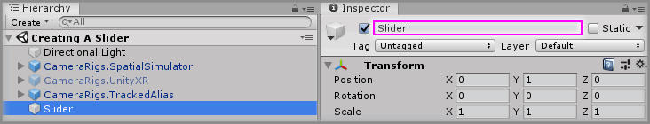

### Step 2

Right click on the `Slider` GameObject, select `3D Object -> Cube` and change the Transform properties to:

* Scale: `X = 1.11, Y = 0.01, Z = 0.02`

Rename the new `Cube` to `SliderBar`.

Finally, disable the automatically created `Box Collider` on the `SliderBar` GameObject.

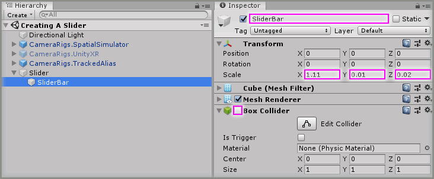

> It may be easier at this point to apply a different material to the SliderBar to make it more distinct.

### Step 3

Create the remaining components of the slider by duplicating the `SliderBar` GameObject 5 times and for each duplicated GameObject change the Transform properties to:

#### SliderBar (1)

* Position: `X = -0.555, Y = 0, Z = 0`
* Scale: `X = 0.01, Y = 0.25, Z = 0.25`

Rename the duplicated `SliderBar (1)` to `MinEnd`.

#### SliderBar (2)

* Position: `X = -0.5, Y = 0, Z = 0`
* Scale: `X = 0.01, Y = 0.05, Z = 0.2`

Rename the duplicated `SliderBar (2)` to `Notch0`.

#### SliderBar (3)

* Position: `X = 0, Y = 0, Z = 0`
* Scale: `X = 0.01, Y = 0.05, Z = 0.2`

Rename the duplicated `SliderBar (3)` to `Notch1`.

#### SliderBar (4)

* Position: `X = 0.5, Y = 0, Z = 0`
* Scale: `X = 0.01, Y = 0.05, Z = 0.2`

Rename the duplicated `SliderBar (4)` to `Notch2`.

#### SliderBar (5)

* Position: `X = 0.555, Y = 0, Z = 0`
* Scale: `X = 0.01, Y = 0.25, Z = 0.25`

Rename the duplicated `SliderBar (5)` to `MaxEnd`.

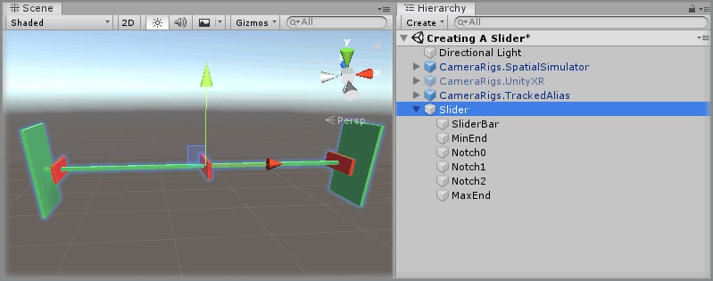

> It may be easier at this point to apply relevant material to the elements to make them more distinct.

### Step 4

Expand the `Tilia Interactions Controllables Unity` Package directory in the Unity Project window and select the `Packages -> Tilia Interactions Controllables Unity -> Runtime -> Prefabs -> PhysicsJoint` directory then drag and drop the `Interactions.LinearJointDrive` prefab into the Unity hierarchy window so it becomes a child of the `Slider` GameObject.


> The `Interactions.LinearJointDrive` prefab uses Unity joints and therefore works within the Unity physics system, however the `Interactions.LinearTransformDrive` is a linear drive that does not utilize joints or physics and can easily be swapped in place at this step if required.

### Step 5

Select the `Slider -> Interactions.LinearJointDrive -> Internal -> JointContainer -> Joint -> Interactions.Interactable -> MeshContainer -> Cube` GameObject from the Unity Hierarchy and change the Transform properties to:

* Scale: `X = 0.1, Y = 0.1, Z = 0.1`

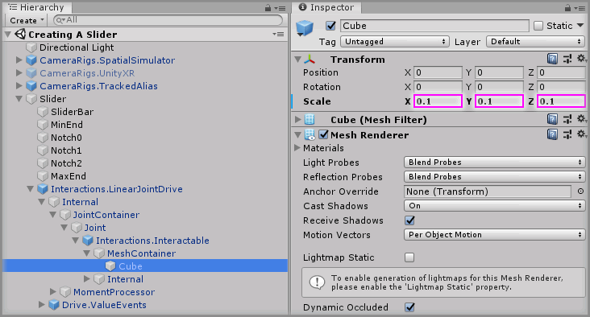

### Step 6

Select the `Slider -> Interactions.LinearJointDrive` GameObject from the Unity Hierarchy and on the `Linear Drive Facade` component set the following properties to:

* Move To Target Value: `checked`
* Target Value: `0`
* Step Range: `Min = 0, Max = 2`

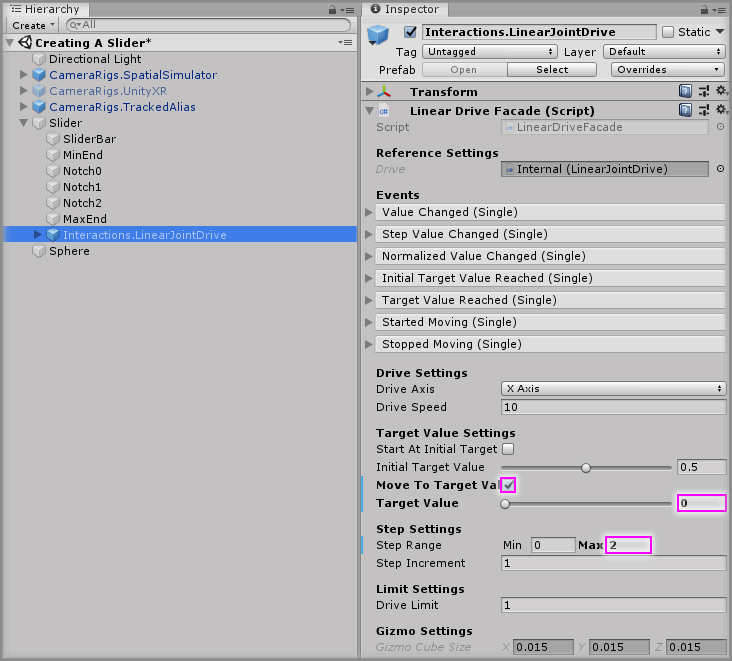

### Step 7

Create a new `Sphere` Unity 3D Object by selecting `Main Menu -> GameObject -> 3D Object -> Sphere` and change the Transform properties to:

* Position: `X = 0, Y = 1, Z = 2`
* Scale: `X = 0.4, Y = 0.4, Z = 0.4`

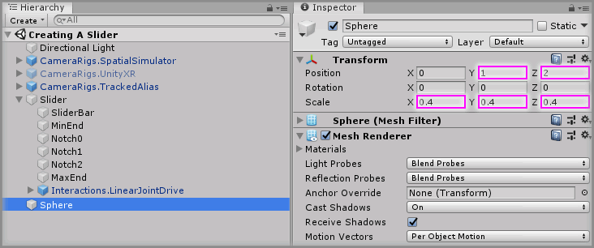

### Step 8

We'll need to create a small script that allows us to change the color of our `Sphere` GameObject when our slider is on a specific step value.

Create a new script by selecting `Main Menu -> Assets -> Create -> C# Script` in the Unity software and name it `ColorChooser`.

Copy and paste the below code into the newly created `ColorChooser` script:

```
using UnityEngine;

public class ColorChooser : MonoBehaviour
{
    public MeshRenderer target;
    public Color[] colors = new Color[0];

    public void SetColor(float index)
    {
        if (index < 0 || index >= colors.Length)
        {
            return;
        }

        target.material.color = colors[(int)index];
    }
}
```

This simple script has a single method called `SetColor` which will take a `float` value that is the index of our `colors` array to change the `target` mesh material to.

> The reason this takes a `float` as the index and not an `int` is because our drive events will emit `float` values as the dynamic properties.

### Step 9

Select the `Sphere` GameObject then click `Add Component` and add the `ColorChooser` component.

Drag and drop the `Sphere` GameObject into the `Target` property on the `ColorChooser` component and set the `Colors -> Size` property value to `3` on the `ColorChooser` component then specify 3 distinct color choices for each color element.

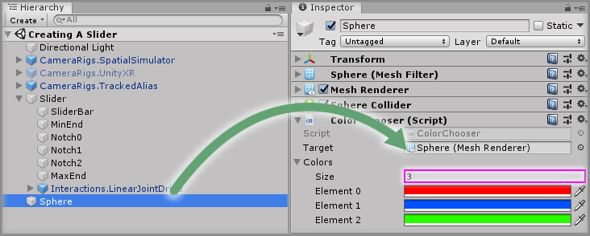

### Step 10

Select the `Slider -> Interactions.LinearJointDrive` GameObject from the Unity Hierarchy and click the `+` symbol in the bottom right corner of the `Step Value Changed` event parameter on the `Linear Drive Facade` component.

Drag and drop the `Sphere` GameObject into the event listener box that appears on the `Step Value Changed` event parameter on the `Linear Drive Facade` component that displays `None (Object)`.

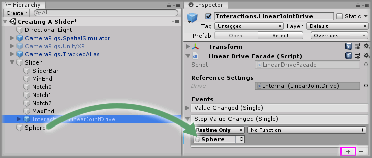

Select a function to perform when the `Step Value Changed` event is emitted. For this example, select the `ColorChooser -> SetColor` function (be sure to select `Dynamic float - SetColor` for this example).

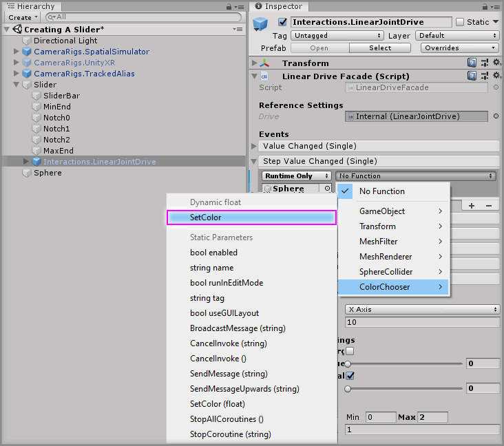

Play the Unity scene and grab the slider cube and try sliding it up and down the linear axis. You'll notice you cannot slide the cube past the limits of the drive and when you pass the certain step notches then the `Sphere` GameObject will change color. However, when you release the slider cube you'll notice the slider snaps back to the original position and does not snap to the nearest step notch.

This is because we have the `Move To Target Value` property on the `Linear Drive Facade` component set to `true`, which will mean the drive will always try and move the control to its current `Target Value` which we also set to `0`.

### Step 11

We can update the `Target Value` to match the current step value we are at by simply adding an event on the drive's internal Interactable so when it is ungrabbed we set the drive's `Target Value` to the current step value.

Select the `Slider -> Interactions.LinearJointDrive -> Internal -> JointContainer -> Joint -> Interactions.Interactable` GameObject from the Unity Hierarchy and click the `+` symbol in the bottom right corner of the `Ungrabbed` event parameter on the `Interactable Facade` component.

Drag and drop the `Slider -> Interactions.LinearJointDrive` GameObject into the event listener box that appears on the `Ungrabbed` event parameter on the `Interactable Facade` component that displays `None (Object)`.

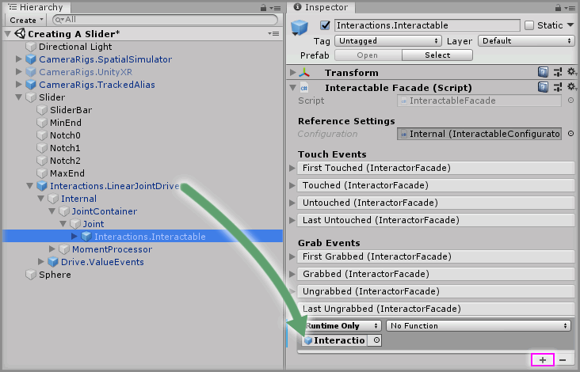

Select a function to perform when the `Ungrabbde` event is emitted. For this example, select the `LinearDriveFacade -> SetTargetValueByStepValue` function (be sure to select `Static Parameters - SetTargetValueByStepValue` for this example).

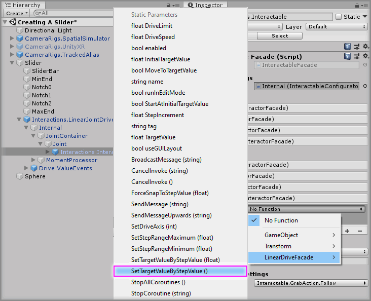

### Done

Play the Unity scene and grab the slider cube again, you'll notice now that when you release the slider it will automatically snap to the nearest step notch.

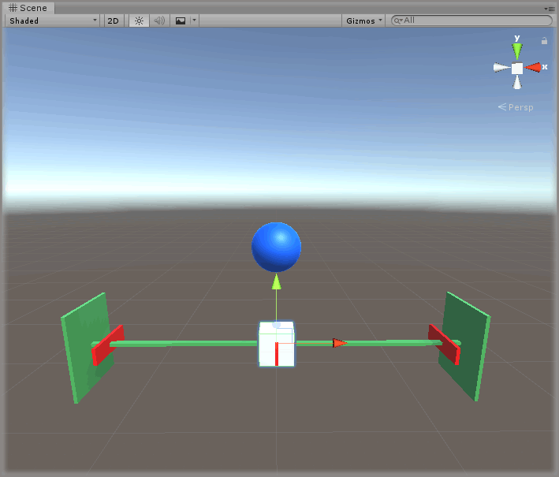

[Add the Tilia.Interactions.Interactor.Unity]: https://github.com/ExtendRealityLtd/Tilia.Interactions.Interactables.Unity/tree/master/Documentation/HowToGuides/AddingAnInteractor/README.md
[Install the Tilia.Interactions.Controllables.Unity]: ../Installation/README.md
[Unity]: https://unity3d.com/