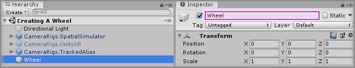
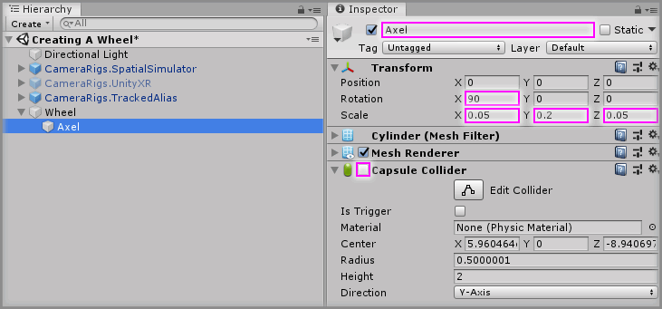
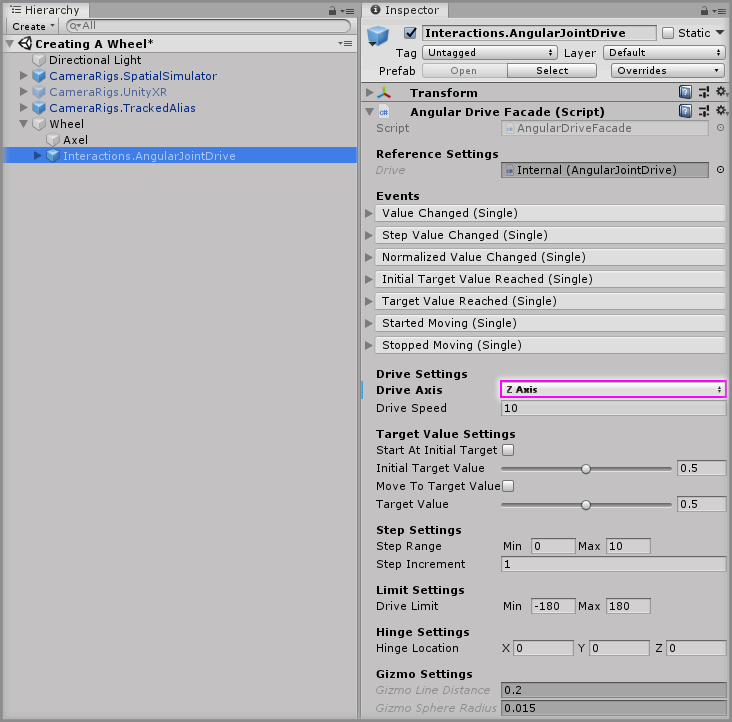
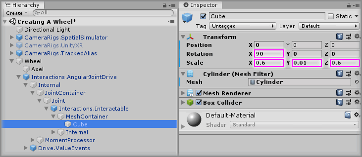
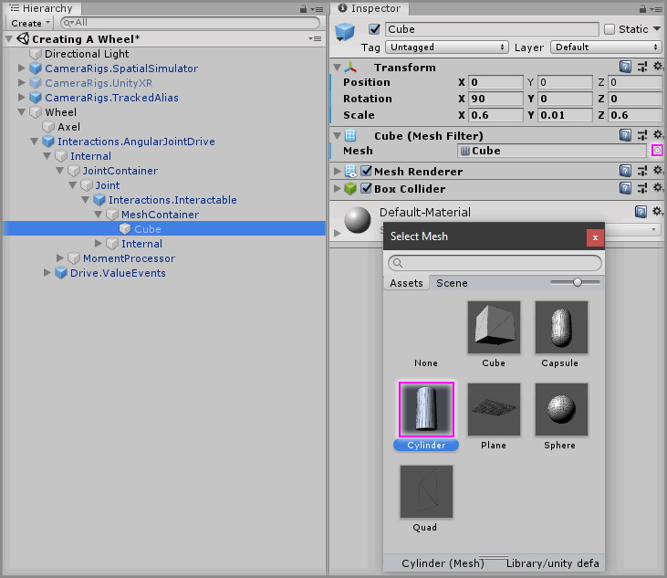
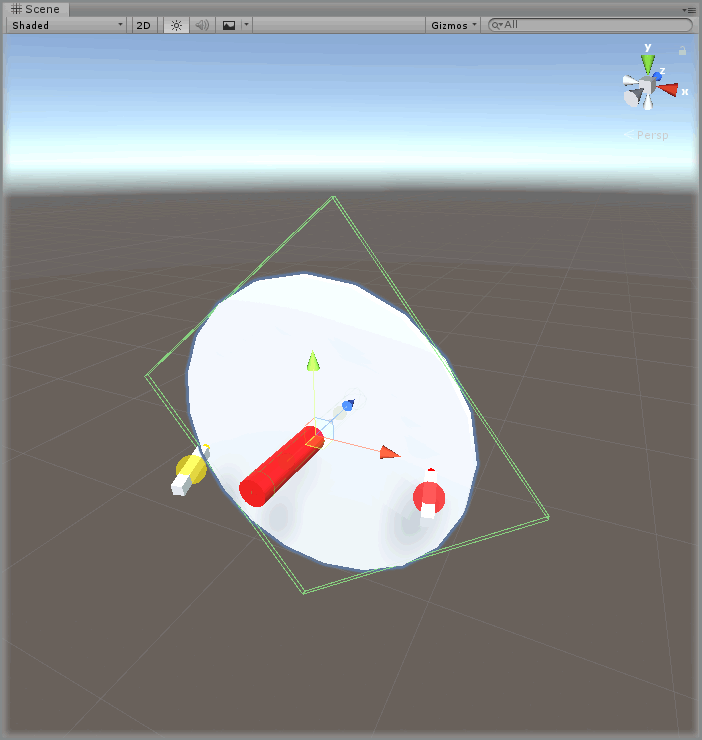

# Creating A Wheel

> * Level: Beginner
> 
> * Reading Time: 5 minutes
> 
> * Checked with: Unity 2018.3.14f1

## Introduction

A wheel control can be created by using a Angular Drive and rotating it around a central hinge point. The wheel value changes could be passed to another component to control it's rotation or to action something when it reaches a certain turn.

## Prerequisites

* [Add the Tilia.Interactions.Interactor.Unity -> Interactions.Interactor] prefab to the scene hierarchy.
* [Install the Tilia.Interactions.Controllables.Unity] package dependency in to your [Unity] project.

## Let's Start

### Step 1

Create a new `Empty` GameObject by selecting `Main Menu -> GameObject -> Create Empty` and rename it to `Wheel`.

### Step 2

Create a new `Cylinder` Unity 3D Object by selecting `Main Menu -> GameObject -> 3D Object -> Cylinder` and make it a child of the `Wheel` GameObject then change the Transform properties to:

* Rotation: `X = 90, Y = 0, Z = 0`
* Scale: `X = 0.05, Y = 0.2, Z = 0.05`

Rename the new `Cylinder` to `Axel` and disable the `Capsule Collider` component.

### Step 3

Add a `Interactions.AngularJointDrive` prefab to the Unity project hierarchy by selecting `GameObject -> Tilia -> Prefabs -> Interactions -> Controllables -> PhysicsJoint -> Interactions.AngularJointDrive` from the Unity main top menu and drag it into being a child of the `Wheel` GameObject.

> The `Interactions.AngularJointDrive` prefab uses Unity joints and therefore works within the Unity physics system, however the `Interactions.AngularTransformDrive` is an angular drive that does not utilize joints or physics and can easily be swapped in place at this step if required.

### Step 4

Select the `Interactions.AngularJointDrive` GameObject from the Unity Hierarchy window and on the `Angular Drive Facade` component set the following properties to:

* Drive Axis: `Z Axis`

### Step 5

Select the `Wheel -> Interactions.AngularJointDrive -> Internal -> JointContainer -> Joint -> Interactions.Interactable -> MeshContainer -> Cube` GameObject and change the Transform properties to:

* Rotation: `X = 90, Y = 0, Z = 0`
* Scale: `X = 0.6, Y = 0.01, Z = 0.6`

### Step 6

On the `Cube (Mesh Filter)` component change the `Mesh` property by clicking the `target` icon and change it to a `Cylinder`.

### Done

Play the Unity scene and grab the wheel with a controller and rotate it around the central axis point by pulling in either rotational direction.

[Unity]: https://unity3d.com
[Add the Tilia.Interactions.Interactor.Unity -> Interactions.Interactor]: https://github.com/ExtendRealityLtd/Tilia.Interactions.Interactables.Unity/tree/master/Documentation/HowToGuides/AddingAnInteractor/README.md
[Install the Tilia.Interactions.Controllables.Unity]: ../Installation/README.md