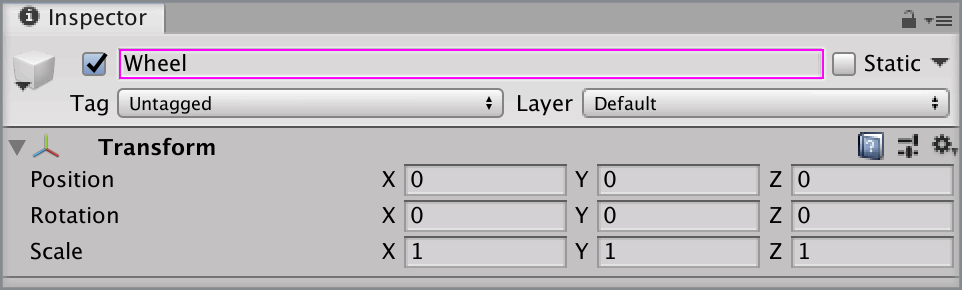
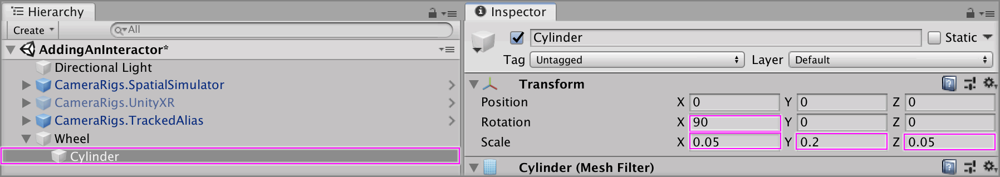
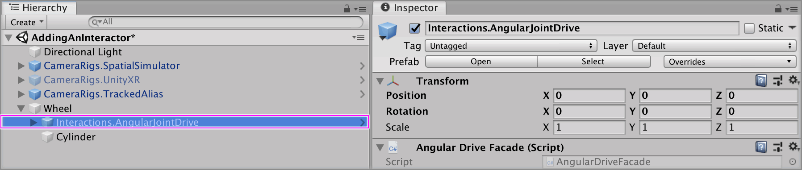
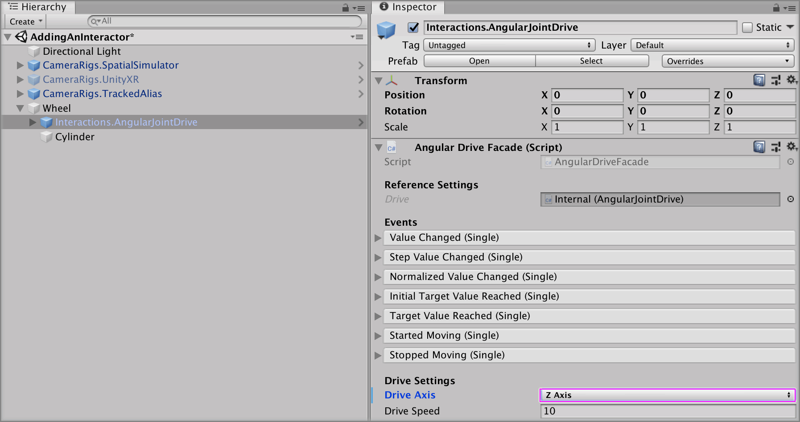
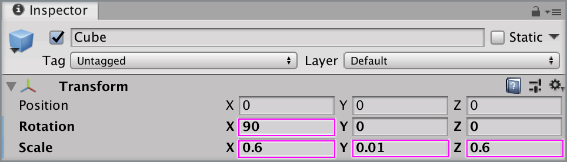
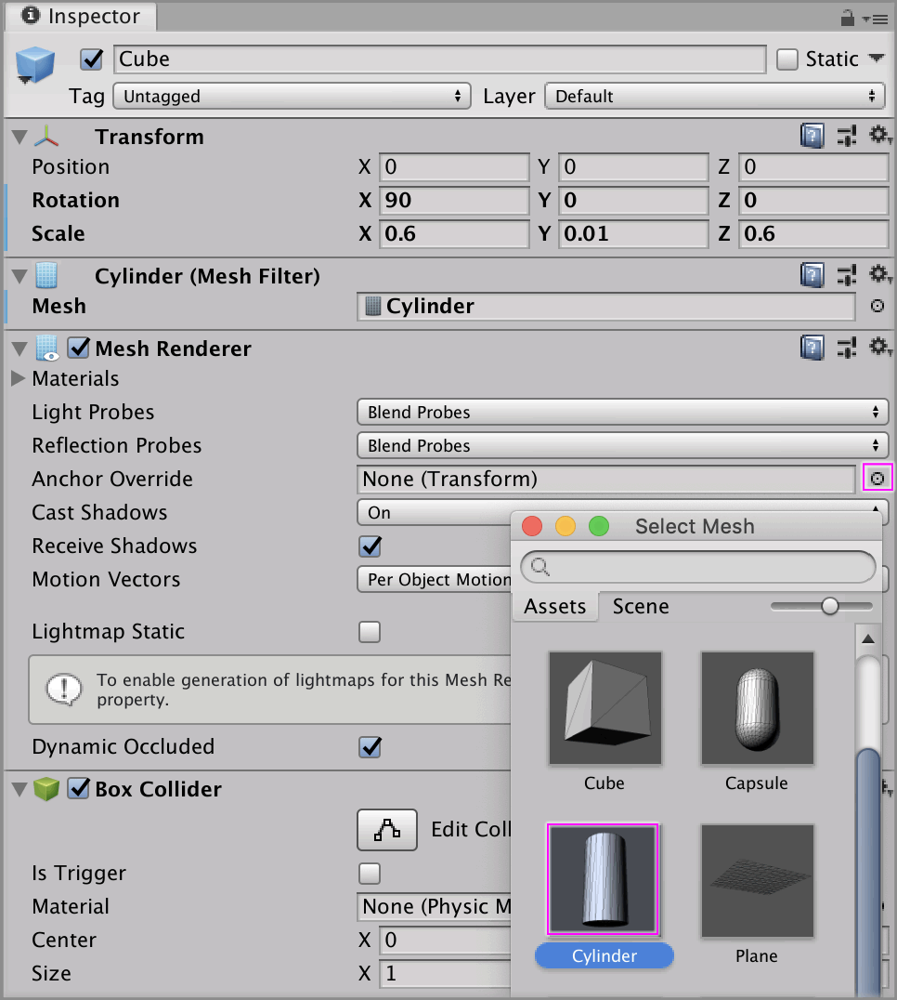
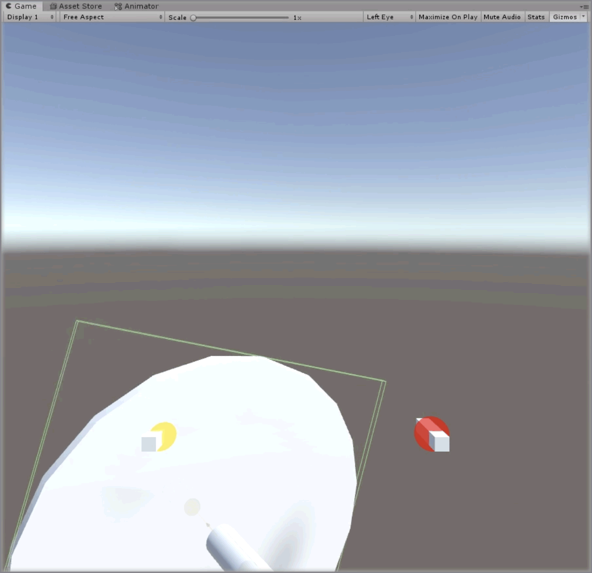

# Creating A Wheel

> * Level: Beginner
>
> * Reading Time: 5 minutes
>
> * Checked with: Unity 2018.3.14f1

## Introduction

A wheel control can be created by using a Angular Drive and rotating it around a central hinge point. The wheel value changes could be passed to another component to control it's rotation or to action something when it reaches a certain turn.

## Prerequisites

* [Add the Tilia.Interactions.Interactor.Unity] prefab to the scene Hierarchy.
* [Install the Tilia.Interactions.Controllables.Unity] package dependency in to your [Unity] project.

## Let's Start

### Step 1

Create a new `Empty` GameObject by selecting `Main Menu -> GameObject -> Create Empty` and rename it to `Wheel`.

### Step 2

Create a new `Cylinder` 3D GameObject by selecting by selecting `Main Menu -> GameObject -> 3D Object -> Cylinder` and make it a child of the `Wheel` GameObject and rename it `Axel`. Change its transform properties to:

*  Rotation: ` X = 90, Y = 0, Z = 0`
*  Scale: ` X = 0.05, Y = 0.2, Z = 0.05`

Make sure to disable its `Capsule Collider` component.

### Step 3

 Grab the `Tilia Interactions Controllables Unity -> Runtime -> Prefabs -> PhysicsJoint -> Interactions.AngularJointDrive` GameObject and put it as a child of the `Wheel` GameObject.
 
 

> The Interactions.AngularJointDrive prefab uses Unity joints and therefore works within the Unity physics system, however the Interactions.AngularTransformDrive is an angular drive that does not utilize joints or physics and can easily be swapped in place at this step if required.

### Step 4

Select the `Interactions.AngularJointDrive` GameObject from the Unity Hierarchy and on the `Angular Drive Facade` component set the following properties to:

* Drive Axis: `Z Axis`

 

### Step 5

Select the `Wheel -> Interactions.AngularJointDrive -> Internal -> JointContainer -> Joint -> Interactions.Interactable -> MeshContainer -> Cube` GameObject and change the transform properties to:

*  Rotation: ` X = 90, Y = 0, Z = 0`
*  Scale: ` X = 0.6, Y = 0.01, Z = 0.6`

 

### Step 6

On the `Cube Mesh Filter` component change the `Mesh` property by clicking the `target` icon, change it to a `cylinder`.

 
 
 ### Done
 
 Play the Unity scene, you will notice that grabbing onto the wheel enables you to rotate it.
 
  

[Unity]: https://unity3d.com/
[Add the Tilia.Interactions.Interactor.Unity]: https://github.com/ExtendRealityLtd/Tilia.Interactions.Interactables.Unity/tree/master/Documentation/HowToGuides/AddingAnInteractor
[Install the Tilia.Interactions.Controllables.Unity]: ../Installation/README.md
