#  Creating An Artifical Button

> * Level: Intermediate
>
> * Reading Time: 10 minutes
>
> * Checked with: Unity 2018.3.14f1

## Introduction

An artificial button is ideal for a simple non physics enabled button that just has the basic action of hitting something and having it push in and pop out. This can be achieved using the Linear Transform Drive along with a Collider Tracker and some clever use of the UnityEvents available.

## Prerequisites

* [Add the Tilia.Interactions.Interactor.Unity] prefab to the scene Hierarchy.
* [Install the Tilia.Interactions.Controllables.Unity] package dependency in to your [Unity] project.

## Let's Start

### Step 1

Create a new `Empty` GameObject by selecting `Main Menu -> GameObject -> Create Empty` and rename it to `ButtonContainer`.

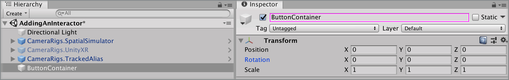

Expand the `Tilia Interactions Controllables Unity` Package directory in the Unity Project window and select the `Packages -> Tilia Interactions Controllables Unity -> Runtime -> Prefabs -> Transform` directory then drag and drop the `Interactions.LinearTransformDrive` prefab into the Unity hierarchy window so it is a child of the `ButtonContainer` GameObject.

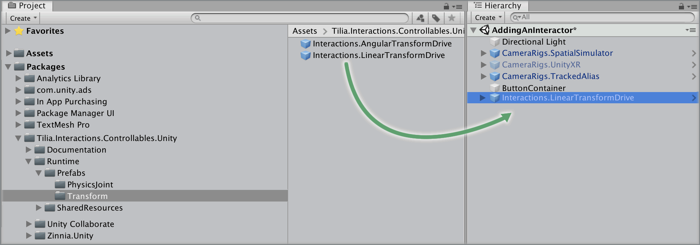

### Step 2

Select the `ButtonContainer -> Interactions.LinearTransformDrive -> Internal -> InteractableContainer -> Interactions.Interactable -> MeshContainer -> Cube` GameObject and change the transform properties to:

*  Scale: ` X = 0.2, Y = 0.05, Z = 0.15`

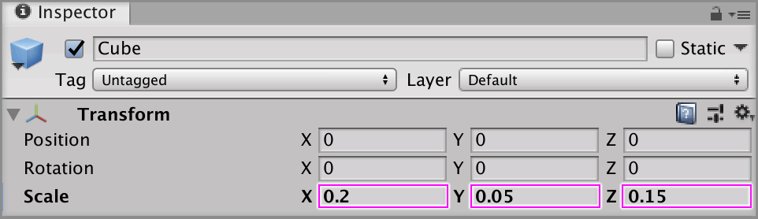

### Step 3

Select the `Interactions.LinearTransformDrive` GameObject from the Unity Hierarchy and on the `Linear Drive Facade` component set the following properties to:

* Drive Axis: `Y Axis`
* Start At Initial Target Value: `checked`
* Initial Target Value: `1`
* Move To Target Value: `checked`
* Moved Target Value: `1`
* Drive Limit: `0.05`

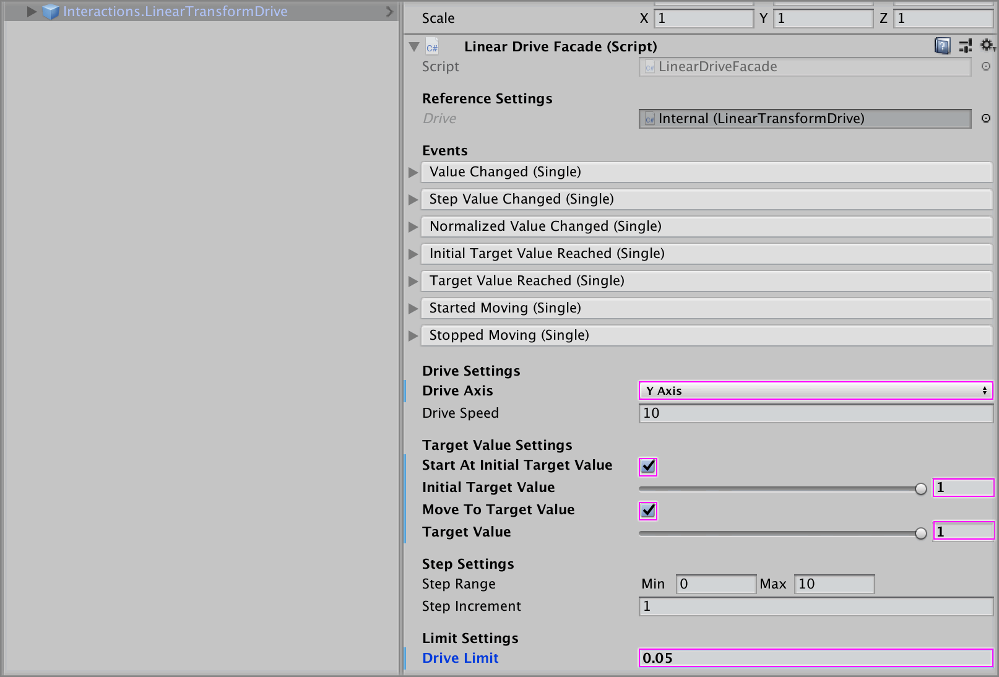

### Step 4

Create a new `Empty` GameObject and make it a child of the `ButtonContainer` GameObject, rename it to `ValidCollisions` add an `Any Component Type Rule`.

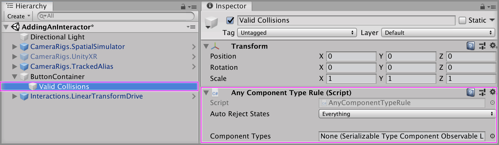

As a child of the `Valid Collisions` GameObject create a new `Empty` GameObject and name it `List`. `Elements -> Size` property on the `Serializable Type Component Observable List` component to `1` and set the `Elements -> Element 0` property to `InteractorFacade`.

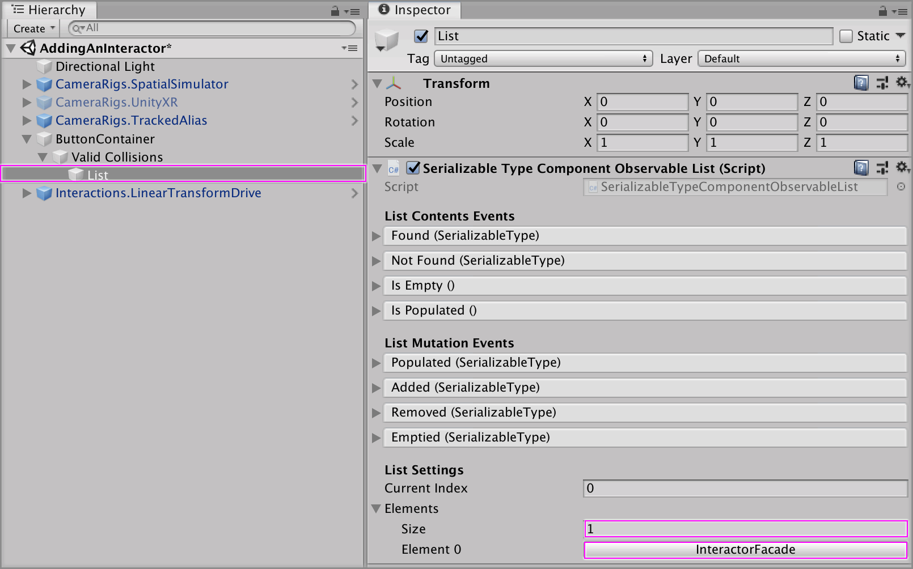

### Step 5

Select the `Valid Collisions` GameObject and drag and drop the `List` GameObject into the `Component Types` property on the `Any Component Type Rule` component.

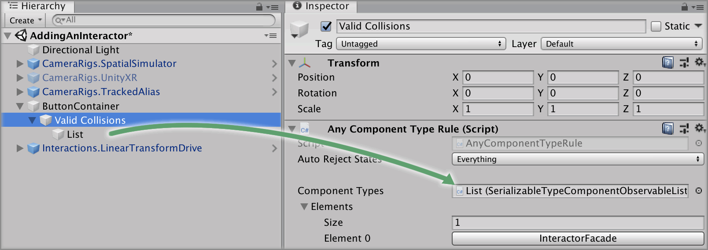

### Step 6

Select the `ButtonContainer -> Interactions.LinearTransformDrive -> Internal -> InteractableContainer -> Interactions.Interactable`, on the `Collision Notifier` component drag and drop the `Valid Collisions` GameObject onto the `Forwarding Source Validity` property.

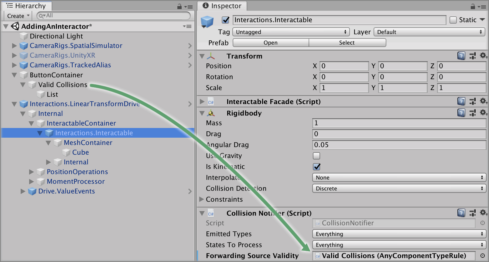

### Step 7

Select the `ButtonContainer -> Interactions.LinearTransformDrive -> Internal -> InteractableContainer` GameObject from the Unity Hierarchy and click the `+` symbol in the bottom right corner of the `First Touched` event parameter on the `Interactable Facade` component.

Drag and drop the `Interactions.LinearTransformDrive` GameObject into the event listener box that appears on the  `First Touched` event parameter on the `Interactable Facade` component that displays `None (Object)`.

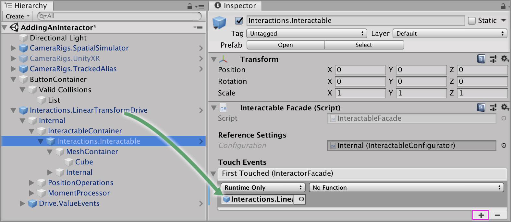

Select a function to perform when the `First Touched` event is emitted. For this example, select the `LinearDriveFacade -> float TargetValue` function and ensure the float value is set to `0`.

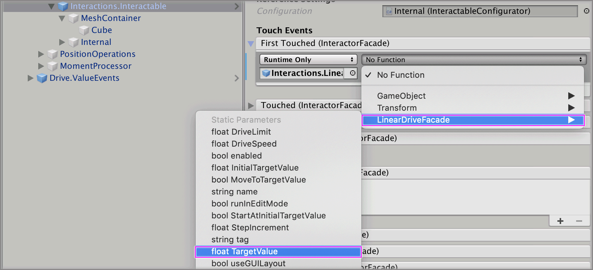

### Step 8

Select the `ButtonContainer -> Interactions.LinearTransformDrive -> Drive.ValueEvents -> EventOutputs -> MinimumReached` GameObject from the Unity Hierarchy and click the `+` symbol in the bottom right corner of the `Activated` event parameter on the `Boolean Action` component.

Drag and drop the `Interactions.LinearTransformDrive` GameObject into the event listener box that appears on the `Activated` event parameter on the `Boolean Action` component that displays `None (Object)`.

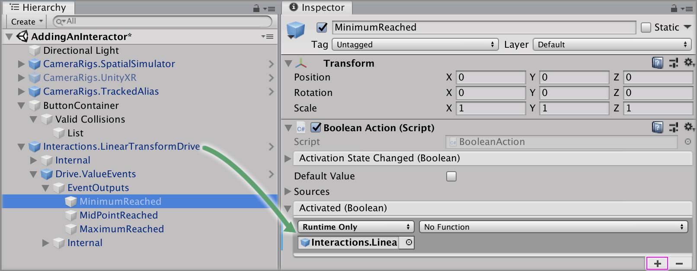

Select a function to perform when the `Activated` event is emitted. For this example, select the `LinearDriveFacade -> float TargetValue` function.

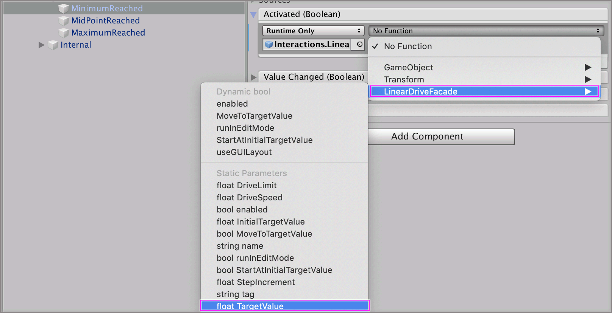

Set the value to `1`.

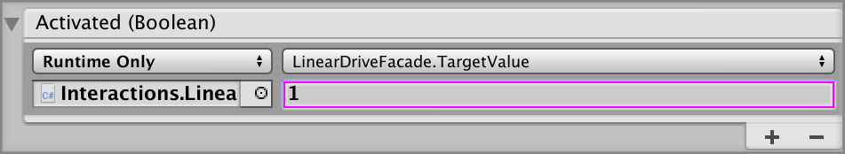

### Done

Play the Unity scene, touching the button with an interactor will automatically trigger the button to go down and then pop back up.

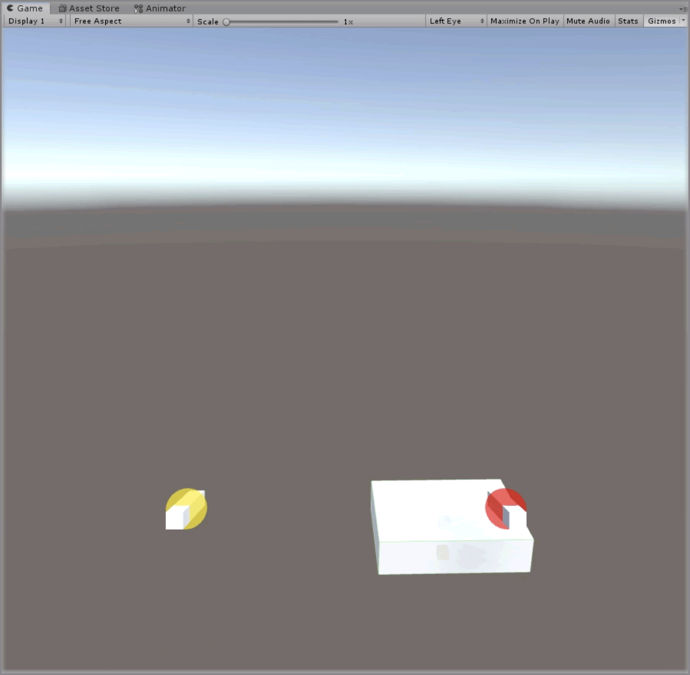

[Unity]: https://unity3d.com/
[Add the Tilia.Interactions.Interactor.Unity]: https://github.com/ExtendRealityLtd/Tilia.Interactions.Interactables.Unity/tree/master/Documentation/HowToGuides/AddingAnInteractor
[Install the Tilia.Interactions.Controllables.Unity]: ../Installation/README.md
