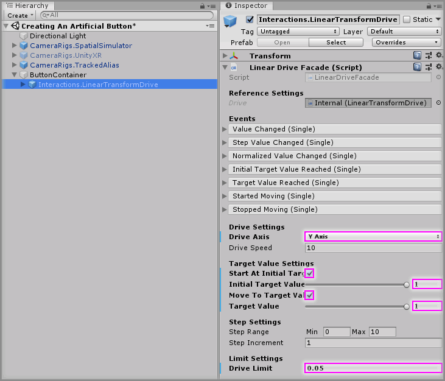

# Creating An Artificial Button

* Level: Beginner

* Reading Time: 10 minutes

* Checked with: Unity 2018.3.14f1

## Introduction

An artificial button is basically a fake button that doesn't use the [Unity] joints or physics system so it is less likely to exhibit adverse physics effects. The artificial button can be crated using the Linear Transform Drive to react to a collision from an Interactor.

## Prerequisites

* [Add the Tilia.Interactions.Interactor.Unity -> Interactions.Interactor] prefab to the scene hierarchy.
* [Install the Tilia.Interactions.Controllables.Unity] package dependency in to your Unity project.

## Let's Start

### Step 1

Create a new `Empty` GameObject by selecting `Main Menu -> GameObject -> Create Empty` and rename it to `ButtonContainer`.

### Step 2

Add a `Interactions.LinearTransformDrive` prefab to the Unity project hierarchy by selecting `GameObject -> Tilia -> Prefabs -> Interactions -> Controllables -> Transform -> Interactions.LinearTransformDrive` from the Unity main top menu and drag it into being a child of the `ButtonContainer` GameObject.

### Step 3

Select the `ButtonContainer -> Interactions.LinearTransformDrive -> Internal -> InteractableContainer -> Interactions.Interactable -> MeshContainer -> Cube` GameObject and change the Transform properties to:

* Scale: `X = 0.2, Y = 0.05, Z = 0.15`

### Step 4

Select the `ButtonContainer -> Interactions.LinearTransformDrive` GameObject from the Unity Hierarchy window and on the `Linear Drive Facade` component set the following properties to:

* Drive Axis: `Y Axis`
* Start At Initial Target Value: `checked`
* Initial Target Value: `1`
* Move To Target Value: `checked`
* Target Value: `1`
* Drive Limit: `0.05`

### Step 5

We want to make our button press down and pop back up when something collides with it. We can do this by simply using the `First Touched` event on the Interactable and changing the target value of the button.

Select the `ButtonContainer -> Interactions.LinearTransformDrive -> Internal -> InteractableContainer -> Interactions.Interactable` GameObject from the Unity Hierarchy window and click the `+` symbol in the bottom right corner of the `First Touched` event parameter on the `Interactable Facade` component.

Drag and drop the `ButtonContainer -> Interactions.LinearTransformDrive` GameObject into the event listener box that appears on the `First Touched` event parameter on the `Interactable Facade` component that displays `None (Object)`.

Select a function to perform when the `First Touched` event is emitted. For this example, select the `LinearDriveFacade -> float TargetValue` property.

Set the `LinearDriveFacade.TargetValue` property value to `0` on the `Interactable Facade` component.

> This will make the button move to the minimum (fully down) position when any Interactor first touches the button.

### Step 6

Now all we need to do is have the button pop back up once it has reached the fully pressed down position. We can achieve this simply by setting the `LinearDriveFacade.TargetValue` back to `1` when the button reaches its minimum position.

Select the `ButtonContainer -> Interactions.LinearTransformDrive -> Drive.ValueEvents -> MinimumReached` GameObject from the Unity Hierarchy window and click the `+` symbol in the bottom right corner of the `Activated` event parameter on the `Boolean Action` component.

Copy the process again in [Step 5] by dragging and dropping the `ButtonContainer -> Interactions.LinearTransformDrive` GameObject into this newly created event listener and setting the function to perform as `LinearDriveFacade -> float TargetValue` property.

Set the `LinearDriveFacade.TargetValue` property value to `1` on the `Boolean Action` component.

### Done

Play the Unity scene and you will notice that when you touch your controller on the button it presses down and pops back up automatically.

[Add the Tilia.Interactions.Interactor.Unity -> Interactions.Interactor]: https://github.com/ExtendRealityLtd/Tilia.Interactions.Interactables.Unity/tree/master/Documentation/HowToGuides/AddingAnInteractor/README.md
[Install the Tilia.Interactions.Controllables.Unity]: ../Installation/README.md
[Unity]: https://unity3d.com/
[Step 5]: #Step-5